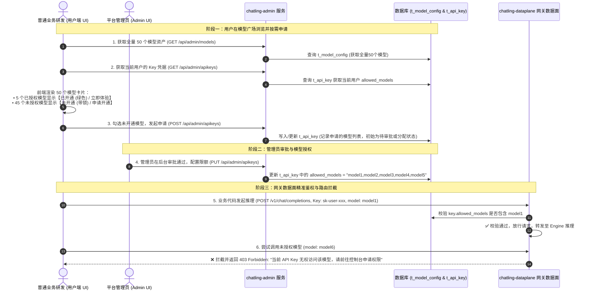

# chatling-admin 模块设计文档 (Architecture & Design)

## 一、 模块定位与职责
`chatling-admin` 是灵犀平台的**业务管理与控制面（Control Plane）**，负责 API Key 凭证生命周期管理、50+ 大模型资产管理、多租户按需权限分配与审批流、用量看板统计。

---

## 二、 核心架构：双端权限交互与模型资产绑定流程

### 1. 双端（用户端 vs 管理员端）权限申请与审批时序图

---

## 三、 数据模型与权限绑定设计

### 1. 物理表结构划分

#### ① 全量大模型资产底表 (`t_model_config`)
平台纳管的 50 个模型在此统一维护：
* `model_name`: 模型唯一英文标识（如 `chatling-turbo`, `deepseek-v3`, `qwen-max`）；
* `display_name`: 模型展示名称（如 `灵犀自研生活服务大模型`）；
* `provider_type`: 提供商类型（`vllm`, `openai`, `dashscope`, `mock`）；
* `base_url`: 上游推理节点地址。

#### ② 用户 API Key 凭证与权限表 (`t_api_key`)
每个用户/业务线在表中持有一条凭证记录：
* `api_key`: `sk-chatling-xxxx`（唯一凭证）；
* `owner_name`: 申请人（如 `zhangsan`）；
* `department`: 归属部门（如 `房产事业部`）；
* **`allowed_models`（权限核心字段）**：
  * 若为 `*`：代表拥有全部 50 个模型的调用权限；
  * 若为指定列表：以逗号分隔，如 `"chatling-turbo,deepseek-v3,qwen-max"`，仅对这几个模型拥有访问权限。
* `tpm_limit`: 每分钟最大 Token 消耗限额；
* `qps_limit`: 每秒最大请求数。

---

## 四、 对外暴露的 RESTful 接口清单

| 接口分组 | Method | 接口路径 | 说明 |
| :--- | :--- | :--- | :--- |
| **模型资产查询** | `GET` | `/api/admin/models` | 获取全平台 50 个模型全量列表 |
| | `POST` | `/api/admin/models` | 管理员录入新模型节点 |
| | `POST` | `/api/admin/models/test-connection` | 测试上游模型 BaseURL 与 Key 连通性 |
| **API Key 与权限** | `GET` | `/api/admin/apikeys` | 获取 Key 列表及其 `allowed_models` 权限 |
| | `POST` | `/api/admin/apikeys` | 用户申请 / 管理员创建 API Key |
| | `PUT` | `/api/admin/apikeys/{apiKey}/status` | 启用 / 禁用 Key |
| | `DELETE` | `/api/admin/apikeys/{id}` | 删除指定 Key |
| **监控看板与审计** | `GET` | `/api/admin/dashboard/stats` | 看板核心 KPI 指标聚合 |
| | `GET` | `/api/admin/dashboard/audits` | 最近 50 条调用审计流水 |
