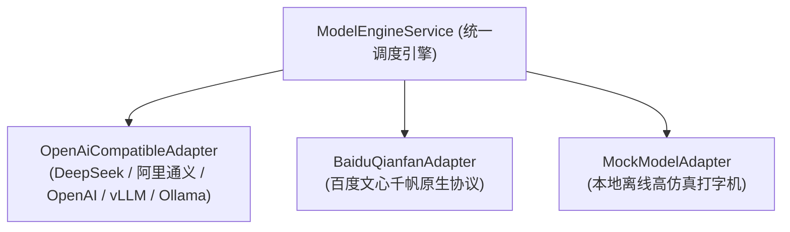

# chatling-core-engine 模块设计文档 (Architecture & Design)

## 一、 模块定位与职责
`chatling-core-engine` 是灵犀平台的大模型统一调度与多厂商适配引擎，负责屏蔽底层各类异构大模型的通信与协议差异。

---

## 二、 核心架构设计

---

## 三、 关键技术机制

1. **响应式非阻塞 IO**：
   - 基于 Spring WebFlux `WebClient` 与 Reactor Netty 连接池，支持高并发长连接 SSE 流式透传。
2. **上游厂商 API Key 自动注入**：
   - 网关接收到携带 `sk-chatling-xxx` 的业务请求后，引擎自动提取目标模型配置的真实 `api_secret`，动态拼装 `Authorization: Bearer <Secret>` 发起真实商用推理。
3. **主备智能 Fallback 容灾**：
   - 当主力大模型节点（如 `chatling-turbo`）网络异常或 5xx 熔断时，引擎自动将请求透传至备用模型（如 `deepseek-v3`）。
