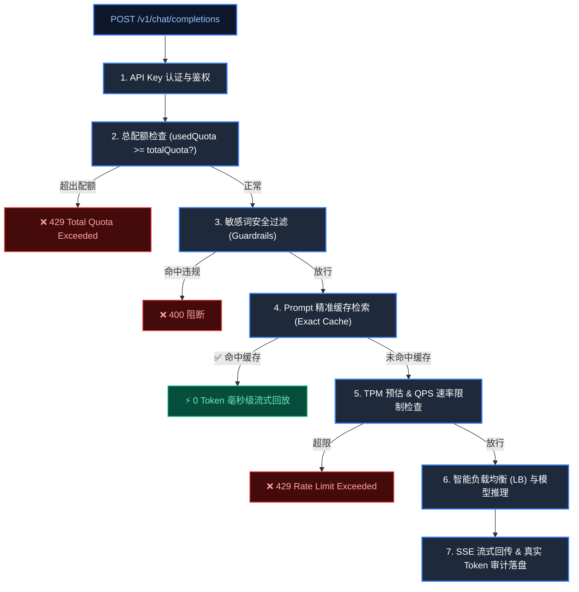

# chatling-dataplane 模块设计文档 (Architecture & Design)

## 一、 模块定位与职责
`chatling-dataplane` 是灵犀 AI 网关的**高并发流量代理与数据面枢纽**，负责对外暴露统一标准的 `/v1/chat/completions` 与 `/v1/models` 接口。

---

## 二、 网关完整处理流水线 (Gateway Full Pipeline)

---

## 三、 核心架构能力详解

1. **一 Key 通行全模型**：
   - 业务方只需持有一张 `allowed_models = "*"` 的通用 API Key，即可自由调用全平台任意开源或商用大模型。
2. **Prompt 缓存加速（Exact Cache）**：
   - 针对大量高频重复提问，计算 SHA-256 Hash，命中后由网关直接秒级流式回放，Token 消耗记为 0，极大降低算力成本与延迟。
3. **毫秒级敏感词安全围栏（Guardrails）**：
   - 基于 DFA 状态机算法在进入模型推理前毫秒级扫描敏感违规词，守住企业 AI 合规底线。
4. **多实例加权轮询与熔断器（LB & Failover）**：
   - 支持单模型配置多台推理机 IP，按权重轮询；某台实例异常连续报错 3 次自动熔断拉黑，无缝切流。
5. **真实 TTFT (首字延迟) 精准度量**：
   - 精准捕获大模型第一个 Token 到达时间（TTFT），在流结束时异步完成账单与审计落盘。
