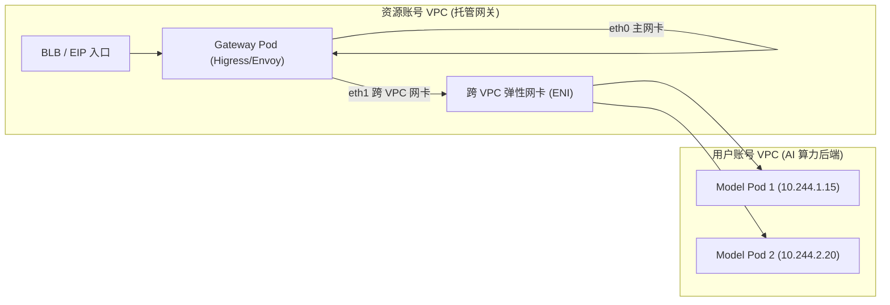

# 云原生 AI 网关核心功能与架构特性全景

本文档系统性整理并归纳了云原生 AI 网关（基于 Higress / Envoy 底座与 Kubernetes 控制面）的 **六大核心功能体系**、**技术实现方案** 与 **核心调用链路**。

---

## 目录
- [一、多模型智能路由与流量治理](#一多模型智能路由与流量治理)
- [二、AI 专属安全与多租户认证](#二ai-专属安全与多租户认证)
- [三、Token 级精细化流控与配额管理](#三token-级精细化流控与配额管理)
- [四、高性能网络与跨 VPC 多租户隔离](#四高性能网络与跨-vpc-多租户隔离)
- [五、全链路 AI 可观测性与审计](#五全链路-ai-可观测性与审计)
- [六、插件化扩展与生态集成](#六插件化扩展与生态集成)
- [七、六大核心功能速览与技术选型对照表](#七六大核心功能速览与技术选型对照表)

---

## 一、多模型智能路由与流量治理

### 1. 按模型名称动态分发（Model-Name Routing）
- **OpenAI 兼容接口支持**：对外统一暴露标准 OpenAI 接口规范（如 `POST /v1/chat/completions`、`GET /v1/models`）。
- **请求体动态解析与打标**：网关在数据面通过轻量级解析插件（Lua EnvoyFilter / Wasm），自动拦截并解析请求 Body 中的 `"model"` 字段（如 `gpt-4`、`deepseek-v3`、`ernie-bot`），动态注入内部头 `x-model-header`。
- **声明式分流**：Istio `VirtualService` 匹配 `x-model-header`，自动路由到对应模型的后端 Kubernetes Service 与 Pod 集群。

### 2. 多模型/多版本按比例分发（Traffic Split / 灰度发布）
- **百分比流量切分**：支持基于权重的多服务流量分发（例如 `70% : 30%`），将相同接口的流量按权重路由至不同提供商或新老模型版本。
- **A/B 测试与蓝绿上线**：平滑推进大模型版本迭代，监控对比新老模型的响应质量与首字延迟。

### 3. 多维匹配与路径重写（Path Matching & Rewrite）
- **复合匹配规则**：支持 URL 前缀匹配（Prefix）、精确匹配（Exact），结合 HTTP Method、自定义 Headers、Query 参数多维度组合匹配。
- **动态路径重写（Path Rewrite）**：支持将前端通用路径（如 `/v1/chat/completions`）重写为后端推理容器的真实私有路径（如 `/api/v1/inference`）。

### 4. AI 场景特化负载均衡算法（KV Cache 亲和性）
- **常规负载均衡**：支持轮询（`round-robin`）、最少连接（`least-conn`）、随机（`random`）。
- **一致性哈希负载均衡（`consistent-hash`）**：
  - 支持基于 `Header`（如 `X-Request-Id`、`session-id`）、`Cookie`、`QueryParam` 或客户端 `IP` 计算哈希值。
  - **业务价值**：在 LLM 上下文对话中，使同一会话连续请求精准命中同一个后端推理 Pod，大幅提高 **KV Cache 命中率**，显著降低 Prefill 耗时与首字时间（TTFT）。

### 5. 弹性容错与重试（Timeout & Retry Policy）
- **超时控制**：秒级/毫秒级可配置的端到端请求超时限制。
- **智能重试机制**：针对 `5xx`、`gateway-error`、`connect-failure`、`reset`、`refused-stream` 等网络与服务端异常自动发起重试，支持限制最大重试次数，保障 AI 服务高可用。

---

## 二、AI 专属安全与多租户认证

```
[ 客户端请求 ] ➔ ( API Key / JWT 鉴权 ) ➔ ( IP 黑白名单 ) ➔ ( 路由白名单校验 ) ➔ [ 放行进入核心路由 ]
```

### 1. 消费者全生命周期管理（Consumer Management）
- 提供租户与消费者（Consumer）的创建、查询、更新、禁用及删除管理。
- 支持为每个消费者分配唯一的身份凭据（API Key / Token / JWT）。

### 2. 路由级白名单鉴权（Route-Level Key-Auth）
- 基于 Higress Wasm 鉴权插件（`key-auth`，优先级 310）实现毫秒级认证。
- 支持在路由级别配置 `allowedConsumers` 白名单，未授权或凭据失效的请求在网关入口直接被拦截并返回 `401 Unauthorized` 或 `403 Forbidden`。

### 3. 企业级外部 CAS 鉴权（External Auth）
- 针对复杂的企业统一账号系统，通过 `ext-auth` 插件以 RPC/HTTP Webhook 形式实时向中央鉴权服务（CAS）发起凭证合法性与权限验证。

### 4. IP 访问控制黑白名单（IP Restriction）
- 支持在网关实例与具体路由维度配置 CIDR IP 网段的白名单与黑名单，防御恶意扫描与非法访问。

---

## 三、Token 级精细化流控与配额管理

### 1. Token 级别多维速率限制（Token Rate Limiting）
传统网关仅支持 QPS（每秒请求数）限流，而大模型请求的资源开销取决于 **Token 吞吐量**。
- **多时间单位**：支持按秒（`second`）、分（`minute`）、时（`hour`）、天（`day`）配置 Token 消耗上限。
- **多维度限制**：支持按消费者（Consumer）、请求头（Header）或查询参数（Query Param）独立计数，后端结合 Redis 实现高并发分布式滑动窗口限流。

### 2. 消费者 Token 总量配额管控（AI Quota）
- 支持为不同级别用户/业务线设置总 Token 额度（Total Quota）或无限制额度（Unlimited Quota）。
- 实时统计并扣减剩余配额，额度用尽时立即优雅拦截（返回 `429 Too Many Requests`），防止因单业务突发用量耗尽整体算力资源。

---

## 四、高性能网络与跨 VPC 多租户隔离



### 1. 控制面与数据面多租户强隔离
- **资源账号 VPC**：运行托管的网关控制面与 Higress 数据面，租户间独立 Namespace / 专属集群隔离。
- **用户账号 VPC**：运行用户私有的 GPU 推理容器（K8s CCE 集群），用户数据资产完全保留在私有网络中。

### 2. 跨 VPC 弹性网卡（ENI）私网直连架构
- **双网卡设计**：网关 Pod 搭载双网卡——`eth0` 接收外网 BLB 入口流量，`eth1` 挂载用户 VPC 的弹性网卡。
- **直连 Pod 零 NAT 损耗**：结合 Istio EDS（端点发现服务），网关直接通过私网 IP 连接用户后端 Pod，绕过 Node 节点 `kube-proxy` 与二次端口转发，达到极致低延迟。

### 3. 多集群跨网格服务发现
- 支持通过跨集群通信机制（如 `create-remote-secret`），实现统一网关调度管理跨地域、多 CCE 集群的后端模型服务。

---

## 五、全链路 AI 可观测性与审计

### 1. LLM 专属业务指标监控（Prometheus / VictoriaMetrics）
网关自动采集并上报大模型推理核心指标：
- **基础网络指标**：QPS、HTTP 状态码分布、请求吞吐量、连接数。
- **LLM 专属指标**：
  - 输入 Token 数（`prompt_tokens`）、输出 Token 数（`completion_tokens`）、总消耗 Token 数；
  - **首字生成时间（TTFT - Time To First Token）**；
  - 完整生成耗时（Total Latency）与流式输出传输耗时；
- **监控无缝对接**：支持一键开启/关闭业务监控，支持 VictoriaMetrics / Prometheus Remote Write 自动注册。

### 2. 百度日志服务（BLS）全量调用审计
- **全生命周期日志采集**：支持按需一键开启/关闭网关实例的 BLS 访问日志采集任务。
- **结构化 AI 审计日志**：自动从 Wasm 过滤器状态（`wasm.ai_log`）提取每一次调用的模型名称、消费者 ID、Token 消耗、耗时、状态码等完整元数据，满足安全合规与计费审计。

---

## 六、插件化扩展与生态集成

```
HTTP 请求 ➔ [ AUTHN 鉴权 ] ➔ [ RATE_LIMIT 限流 ] ➔ [ ROUTE 路由打标 ] ➔ [ STATS 计量统计 ] ➔ 上游模型
```

### 1. 基于 Wasm-Go 的高性能热插拔插件流水线
- **生命周期分阶段调度**：插件按照执行阶段严格排序（`AUTHN` ➔ `RATE_LIMIT` ➔ `ROUTE` ➔ `STATS`），互不干扰。
- **动态加载与零停机热更新**：通过修改 `WasmPlugin` CRD 即可实现插件配置秒级生效与热插拔，无需重启网关代理进程。

### 2. MCP 与多协议转换生态
- 支持协议适配层（如 `restful-to-mcp`），方便 AI Agent 生态下 MCP (Model Context Protocol) 工具与后端 RESTful 微服务之间的无缝互通。

---

## 七、六大核心功能速览与技术选型对照表

| 功能大类 | 核心特性与解决的痛点 | 底层核心技术组件 / CRD |
| :--- | :--- | :--- |
| **一、智能路由与治理** | 支持大模型按名称动态分流、比例灰度、一致性哈希（提升 KV Cache 命中） | `VirtualService`, `DestinationRule`, Lua `EnvoyFilter` |
| **二、安全与多租户认证** | 消费者 API Key 凭证管理、路由级鉴权白名单、CAS 外部鉴权、IP 黑白名单 | `WasmPlugin (key-auth, ext-auth, ip-restriction)` |
| **三、Token 流控与配额** | Token/秒/分/时多时间粒度限流、消费者总 Token 配额管控 | `WasmPlugin (token-rate-limit, ai-quota)` + Redis |
| **四、高性能跨 VPC 网络** | 租户间强隔离、网关多网卡跨 VPC ENI 直连 Pod IP，绕过 kube-proxy | CCE Multi-NIC, Istio EDS (Endpoint Discovery) |
| **五、全链路可观测性** | 首字时间 (TTFT)、Prompt/Completion Tokens 监控报表与 BLS 全量审计 | VictoriaMetrics/CProm, BLS Task, `wasm.ai_log` |
| **六、插件化生态扩展** | Wasm-Go 插件生命周期流水线、动态热插拔、MCP 协议转换 | `WasmPlugin (extensions.higress.io)`, MCP Bridge |
