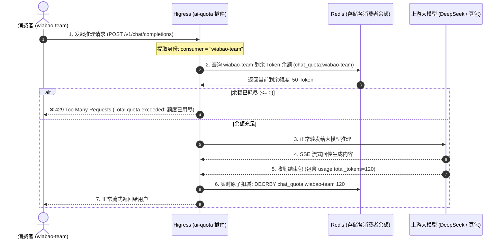

# Higress `ai-quota`（AI Token 总配额与预算管控插件）核心架构与实战指南

本文档深入解析 Higress 官方插件 **`ai-quota`** 的底层工作机制、Token 余额原子扣减机制、管理员充值 API 规范以及与 `ai-token-ratelimit` 的联动架构。

---

## 目录
- [一、 `ai-quota`（总预算）vs `ai-token-ratelimit`（流控）对比](#一-ai-quota总预算vs-ai-token-ratelimit流控对比)
- [二、 核心架构与请求处理时序图](#二-核心架构与请求处理时序图)
- [三、 插件配置规范 (YAML)](#三-插件配置规范-yaml)
- [四、 管理员 Token 配额管理 API 规范](#四-管理员-token-配额管理-api-规范)
- [五、 生产级双流控组合拳架构](#五-生产级双流控组合拳架构)

---

## 一、 `ai-quota`（总预算）vs `ai-token-ratelimit`（流控）对比

| 维度 | `ai-token-ratelimit` (滑动窗口限流) | `ai-quota` (总配额与预算管控) |
| :--- | :--- | :--- |
| **管控核心** | **请求速率 / 瞬时并发** (RPM / TPM) | **总资产 / 账户余额 / 月度总额度** (Total Quota) |
| **时间周期** | 固定小周期滑动（1秒、1分钟、1小时） | **长期持久化**（直到额度耗尽或管理员充值） |
| **重置方式** | 时间窗口过后自动重置恢复 | **不自动重置**，余额为 0 时永久阻断，需人工/系统充值 |
| **业务目标** | 防止单团队瞬时高频并发把大模型算力打崩 | **控制部门月度财务预算、为外部客户提供预付费 Token 计费** |

---

## 二、 核心架构与请求处理时序图



---

## 三、 插件配置规范 (YAML)

在 Higress 控制台「插件配置」或具体「AI 路由 ➡️ 策略」中开启并配置：

```yaml
# 1. Redis 连接配置 (存储各消费者的持久化余额)
redis:
  service_name: my-redis.dns
  service_port: 6379
  timeout: 2000

# 2. Redis 键前缀 (默认 chat_quota:)
redis_key_prefix: "chat_quota:"

# 3. 指定拥有管理充值权限的消费者名称 (如 customer-service)
admin_consumer: "customer-service"

# 4. 配额管理 API 的路径前缀 (默认为 /quota)
admin_path: "/quota"
```

---

## 四、 管理员 Token 配额管理 API 规范

持有 `admin_consumer` 凭证的管理员，可以直接通过网关提供的内置 HTTP API 对任何消费者进行额度查询、重置和追加：

### 1. 刷新/重置配额 (`/quota/refresh`)
为指定团队重新设定固定总额度（例如为 `wiabao-team` 分配 100,000 Token）：
```bash
curl --noproxy "*" -X POST 'http://127.0.0.1:8080/v1/chat/completions/quota/refresh' \
  -H "Authorization: Bearer <管理员Key>" \
  -H "Content-Type: application/x-www-form-urlencoded" \
  -d 'consumer=wiabao-team&quota=100000'
```

### 2. 查询剩余配额 (`/quota`)
实时查询某个消费者的剩余可用 Token 数：
```bash
curl --noproxy "*" 'http://127.0.0.1:8080/v1/chat/completions/quota?consumer=wiabao-team' \
  -H "Authorization: Bearer <管理员Key>"
```
> **返回示例**：
> ```json
> {
>   "consumer": "wiabao-team",
>   "quota": 98450
> }
> ```

### 3. 追加/扣减配额 (`/quota/delta`)
在当前剩余余额的基础上增加或扣减额度（支持正负数）：
```bash
curl --noproxy "*" -X POST 'http://127.0.0.1:8080/v1/chat/completions/quota/delta' \
  -H "Authorization: Bearer <管理员Key>" \
  -H "Content-Type: application/x-www-form-urlencoded" \
  -d 'consumer=wiabao-team&value=50000'
```

---

## 五、 生产级双流控组合拳架构

在企业级落地中，通常将 **`ai-quota`** 与 **`ai-token-ratelimit`** 串联使用，形成双重立体防护：

```
[ 客户端请求: Authorization: Bearer sk-wiabao-xxx ]
      ⬇️
1. 【Key-Auth 认证】校验 Key 合法性，提取消费者 identity: wiabao-team
      ⬇️
2. 【AI Quota 检查】wiabao-team 总账户余额是否 > 0？（否 ➔ 429 额度用尽拦截）
      ⬇️
3. 【AI Token 限流】wiabao-team 当前 1 分钟内并发 TPM/RPM 是否超限？（是 ➔ 429 速率超限拦截）
      ⬇️
4. 【语义缓存 / 上游推理】放行进入模型处理链路
```
