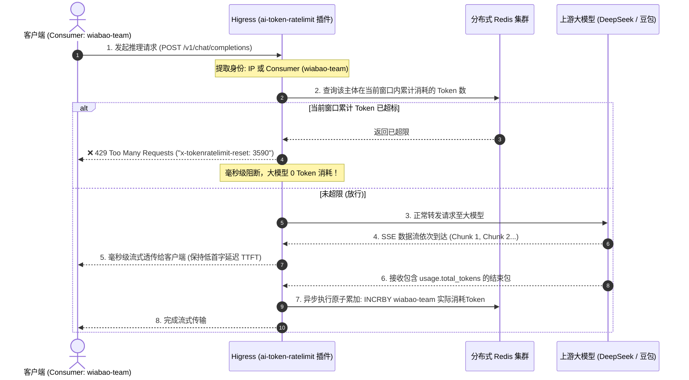
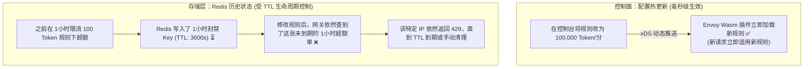

# Higress `ai-token-ratelimit`（AI Token 级流控限流插件）核心架构与实战深度解析

本文档深入解析 Higress 官方核心流控插件 **`ai-token-ratelimit`** 的底层工作机制、分布式滑动窗口算法、双向流式拦截时序图，以及 **配置动态热加载与 Redis 历史状态生命周期** 的核心原理。

---

## 目录
- [一、 传统网关限流 vs AI Token 限流的核心差异](#一-传统网关限流-vs-ai-token-限流的核心差异)
- [二、 核心工作原理与全链路流式时序图](#二-核心工作原理与全链路流式时序图)
- [三、 底层算法：分布式 Redis 滑动窗口计数器](#三-底层算法分布式-redis-滑动窗口计数器)
- [四、 深度剖析：配置热更新 vs Redis 历史状态 (为什么改了配置还会 429？)](#四-深度剖析配置热更新-vs-redis-历史状态-为什么改了配置还会-429)
- [五、 标准配置模板与多租户隔离实战](#五-标准配置模板与多租户隔离实战)
- [六、 生产运维排查与常见问题 (FAQ)](#六-生产运维排查与常见问题-faq)

---

## 一、 传统网关限流 vs AI Token 限流的核心差异

| 维度 | 传统网关限流 (Rate Limiting) | AI 时代 Token 限流 (AI Token Rate Limit) |
| :--- | :--- | :--- |
| **度量维度** | **请求次数 (QPS / RPM)** | **真实 Token 消耗量 (TPM) + 请求次数 (RPM)** |
| **计费与算力关联** | 无法感知请求处理的计算开销 | 严格对齐 GPU 算力消耗与上游 Token 账单 |
| **拦截时机** | 请求到达网关入口处即可判定 | **前置根据历史用量判定拦截 + 后置流式提取真实 Token 异步原子累加** |
| **业务价值** | 防止下游高频打崩服务器网络连接 | **防止单个租户恶意消耗巨额算力，实现跨部门公平调度** |

---

## 二、 核心工作原理与全链路流式时序图

`ai-token-ratelimit` 是运行在 Envoy 数据面中的高性能 Wasm 插件，针对大模型 **流式输出（Server-Sent Events / SSE）** 进行了零延迟优化：



---

## 三、 底层算法：分布式 Redis 滑动窗口计数器

插件通过在 Redis 中构造带有精准 TTL（生存时间）的 Key 来维护滑动窗口：

1. **Key 命名格式**：
   ```text
   higress-token-ratelimit:{rule_name}:{match_type}:{window_seconds}:{identity}
   ```
   * *示例*：`higress-token-ratelimit:{default_rule}:limit_by_per_ip:3600:from-remote-addr:192.168.65.1`
2. **原子递增与过期控制**：
   * 采用 Redis Lua 脚本或 `INCRBY` + `EXPIRE` 原子命令，保证在分布式多网关节点下并发计数的绝对精确。

---

## 四、 深度剖析：配置热更新 vs Redis 历史状态 (为什么改了配置还会 429？)

在实际运维和调试中，经常遇到：**“我已经把规则从 100 Token 改成 10 万 Token 了，为什么调接口依然报 429？”**

### 1. 核心机制：规则定义是无状态热加载的，但用量计数是有状态持久化的！



### 2. 生活中的通俗比喻：交规更新 vs 驾照扣分记录
* **修改网关限流配置（交规更新）**：交管部门出台了新规定，系统规则即刻生效。新来的驾驶员完全不受老规则限制。
* **Redis 历史状态（驾照已被扣满 12 分）**：在改交规前，张三因为违章被扣满了 12 分（处于 1 小时封禁期）。即使新交规放宽了，车管所电脑里张三的“封禁倒计时单”只要还没过期，张三依然无法上路，直到消分或周期结束。

### 3. 运维实战与测试建议
* **全新客户端不受影响**：换一个全新的 IP 或换一个全新的 Consumer Key，会立即享受新配置的大额度，完全不会被 429。
* **一键重置测试环境**：如果想让被封禁的测试 IP/账号立刻解封，只需在 Redis 执行一键清理：
  ```bash
  # 清理所有限流历史状态 Key
  docker exec higress-redis redis-cli del "higress-token-ratelimit:*"
  # 或一键清空测试数据库
  docker exec higress-redis redis-cli flushdb
  ```

---

## 五、 标准配置模板与多租户隔离实战

### 1. 标准 YAML 配置

```yaml
# 1. 指定使用的 Redis 服务 (通过服务来源创建)
redis:
  service_name: my-redis.dns
  service_port: 6379
  timeout: 2000

# 2. 超限时的响应定义
rule_name: "enterprise_token_limit"
rejected_code: 429
rejected_msg: "Too Many Requests: Token or RPM limit exceeded!"

# 3. 按多租户/消费者独立精细化限流
rule_items:
  # 场景 A: 按具体消费者独立分配配额 (VIP 与 普通团队)
  - limit_by_per_consumer: custom
    limit_keys:
      - key: "dianshang-app"     # 电商核心团队 (VIP)
        token_per_minute: 500000 # 独立享受 50万 Token/分
      - key: "customer-service"  # 客服系统
        token_per_minute: 100000 # 独立享受 10万 Token/分
      - key: "wiabao-team"       # 外包团队
        token_per_minute: 5000   # 独立享受 5000 Token/分

  # 场景 B: 兜底 IP 级限流 (防止外部未认证匿名刷量)
  - limit_by_per_ip: "from-remote-addr"
    limit_keys:
      - key: "0.0.0.0/0"
        token_per_minute: 10000
```

---

## 六、 生产运维排查与常见问题 (FAQ)

### Q1: 在控制台添加插件时报错 409 Conflict 是什么原因？
* **原因**：`ai-token-ratelimit` 是 Higress 官方预置的**内置插件**。在“添加插件”弹窗中输入已存在的名字会导致命名冲突（HTTP 409）。
* **正确做法**：直接在插件列表中找到自带的 `ai-token-ratelimit`，点击右侧的开关并配置 YAML 即可。

### Q2: 请求耗时较长（如生成长诗超过 60 秒）时为什么没限制住？
* **原因**：当规则设置为 `token_per_minute`（1 分钟窗口）时，如果单次请求耗时达到了 61 秒，大模型返回时时间已经跨入了下一个新的 1 分钟周期，因此重新获得了新的配额。
* **解决办法**：在生产中将时间窗口拉长为 `token_per_hour`（按小时）或 `token_per_day`（按天），或者搭配 **`ai-quota`（总配额插件）** 实现长期总预算管控。
