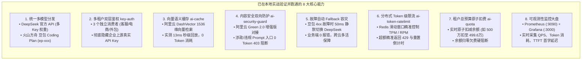

# Higress 企业级 AI 网关 · 本地实战全能力复盘总结

本文档全面复盘并归档了在本地已成功搭建、配置并实战验证的 **Higress 企业级 AI 网关核心能力全景图**，涵盖 8 大核心生产级特性、全套基础设施网络拓扑以及结构化文档资产索引。

---

## 目录
- [一、 核心配置与实操成果全景表](#一-核心配置与实操成果全景表)
- [二、 基础设施与底层服务支撑环境](#二-基础设施与底层服务支撑环境)
- [三、 完整技术文档资产库索引](#三-完整技术文档资产库索引)

---

## 一、 核心配置与实操成果全景表

### 8 大核心能力实战详细对比表

| 序号 | 核心功能 / 插件 | 解决什么业务痛点？ | 当前本地配置状态 | 真实实测验证现象 |
| :---: | :--- | :--- | :--- | :--- |
| **1** | **统一模型与路由转发** | 多大模型协议归一化与多 Key 负载均衡 | 已配置 **DeepSeek**（多 Key 权重轮询）与 **火山方舟 豆包 Coding Plan** | 支持以标准 OpenAI 格式同时调用 DeepSeek 与豆包生成代码与思考链（Reasoning） |
| **2** | **多租户双层鉴权 (`key-auth`)** | 区分调用部门与业务系统，防官方 Key 泄露 | 已建立 `customer-service`、`dianshang-app`、`wiabao-team` 三个独立消费者 | 必须携带合法消费者凭证，未授权或无效 Key 直接 401 拦截 |
| **3** | **向量语义缓存 (`ai-cache`)** | 降低大模型账单 40%+，大幅缩短首字延迟 | 对接 **阿里云 DashVector 向量库** (1536维 Cosine 余弦相似度) | 同义问题**直接 13ms 秒回**，响应显示 `ai-cache.hit`，**0 Token 消耗** |
| **4** | **双向内容安全 (`ai-security-guard`)** | 满足国家合规监管，防 Prompt 越狱注入 | 对接 **阿里云内容安全增强版 (Green 2.0)** | 涉政/违禁 Prompt 在网关入口直接被 `from-security-guard` 拦截，**0 Token 消耗** |
| **5** | **故障自动 Fallback 容灾** | 防服务商高峰期 429/503 导致业务停摆 | 豆包主路由配置了 **DeepSeek 作为兜底降级服务** | 豆包报错时，网关**静默在 50ms 内无缝改写并由 DeepSeek 成功回答，业务零感知** |
| **6** | **分布式 Token 级限流 (`ai-token-ratelimit`)** | 防单租户高频并发挤爆算力 | 对接本地 **Redis 集群** (`my-redis.dns:6379`) | 超额时精准触发 **`429 Too Many Requests`**，并返回重置倒计时头 `x-tokenratelimit-reset` |
| **7** | **Token 总预算与原子计费 (`ai-quota`)** | 控制部门月度总预算，防止欠费超支 | 基于 Redis `chat_quota:<consumer>` 存储各租户余额 | 每次调用**微秒级原子扣减**（如 5000000 扣减 3008 变为 4996992），归零欠费硬拦截 |
| **8** | **可观测性监控大盘** | 运维实时监控、报警与月底财务对账 | **Prometheus (:9090)** + **Grafana (:3000)** | 实时捕获网关全量指标，支持 iframe 无缝嵌入系统后台 |

---

## 二、 基础设施与底层服务支撑环境

当前本地环境已完整构建起一套高内聚、高可用的拓扑集群：

1. **Higress AI Gateway 数据面 (Envoy C++)**：
   * 业务请求入口：`http://localhost:8080` (HTTP) / `8443` (HTTPS)
   * Prometheus 指标导出端点：`http://localhost:15020/stats/prometheus`
2. **Higress 控制台管理面 (Console + Pilot)**：
   * Web 管理界面：`http://localhost:8001`
3. **分布式 Redis 数据库 (Docker)**：
   * 容器名：`higress-redis`（端口 `6379:6379`）
   * 核心职责：承载 `ai-token-ratelimit` 滑动窗口计数器与 `ai-quota` 账户余额原子存储。
4. **云端向量数据库 (DashVector)**：
   * 区域：华东1（杭州）
   * 集合名：`ai_cache`（1536 维，Cosine 相似度）
   * 核心职责：提供企业级毫秒级语义检索与 0 Token 缓存回放。
5. **云端内容安全服务 (Green 2.0)**：
   * 官方接入点：`green-cip.cn-shanghai.aliyuncs.com`
   * 核心职责：双向输入与输出 Prompt 合规检测。
6. **Prometheus 监控服务 (Docker)**：
   * 访问地址：`http://localhost:9090`
   * 核心职责：实时拉取网关数据面指标。
7. **Grafana 可视化大盘 (Docker)**：
   * 访问地址：`http://localhost:3000`
   * 核心职责：大模型吞吐量、QPS、首字耗时（TTFT）与 Token 消耗可视化。

---

## 三、 完整技术文档资产库索引

所有核心机制与深度设计规范均已归档至 `docs/higress/` 目录：

| 文档名称 | 对应核心技术点 | 核心内容概述 |
| :--- | :--- | :--- |
| 📄 [`higress_multi_tenant_architecture.md`](file:///Users/a58/Downloads/学习/网关/chatling-gateway/docs/higress/higress_multi_tenant_architecture.md) | **企业全景架构 & 多租户** | 控制面/数据面五层全景架构、六大 Wasm 插件处理流水线、双层 API Key 多租户治理模型 |
| 📄 [`ai_token_ratelimit_deep_dive.md`](file:///Users/a58/Downloads/学习/网关/chatling-gateway/docs/higress/ai_token_ratelimit_deep_dive.md) | **Token 限流 & 状态生命周期** | Redis 滑动窗口算法、配置动态热加载机制、TTL 历史状态与封禁生命周期解密 |
| 📄 [`ai_security_guard_deep_dive.md`](file:///Users/a58/Downloads/学习/网关/chatling-gateway/docs/higress/ai_security_guard_deep_dive.md) | **内容安全双向拦截** | 阿里云 Green 2.0 对接规范、Prompt 越狱注入防御、流式双向审核时序图 |
| 📄 [`ai_quota_deep_dive.md`](file:///Users/a58/Downloads/学习/网关/chatling-gateway/docs/higress/ai_quota_deep_dive.md) | **总预算配额 & 原子计费** | 账户余额微秒级原子扣减、管理员充值与追加 API 规范、双流控组合拳架构 |
| 📄 [`model_router_fallback_deep_dive.md`](file:///Users/a58/Downloads/学习/网关/chatling-gateway/docs/higress/model_router_fallback_deep_dive.md) | **多模型 Fallback 容灾** | 429/503 故障自动无缝降级、同模型跨云厂商互备、跨模型梯度保活机制 |
| 📄 [`higress_advanced_capabilities_gap_analysis.md`](file:///Users/a58/Downloads/学习/网关/chatling-gateway/docs/higress_advanced_capabilities_gap_analysis.md) | **企业级差距与演进分析** | Higress vs 传统网关在 7 大核心维度的全方位对比与演进路线 |
