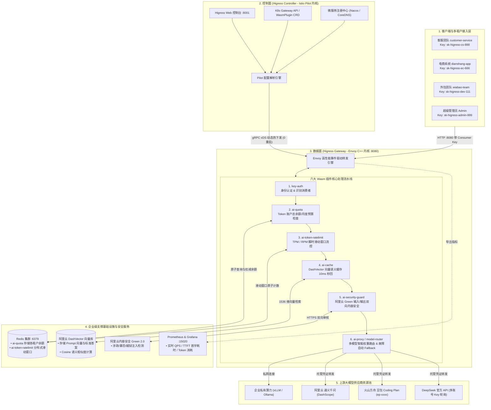
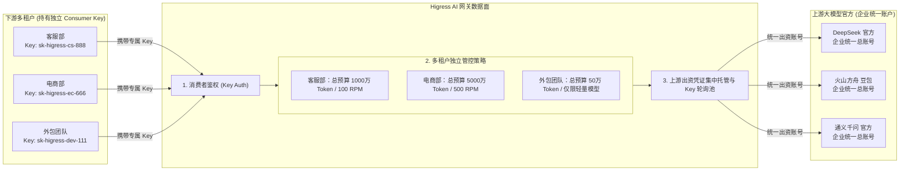
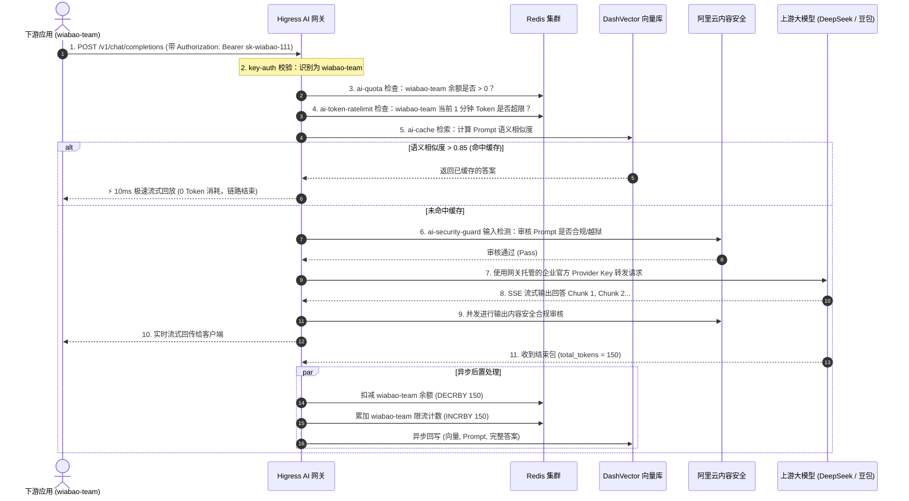

# Higress 企业级全景架构与多租户全治理体系

本文档系统性阐述了 **Higress AI 网关在企业级生产环境下的全景架构**，涵盖 **控制面与数据面解耦**、**多租户双层 API Key 体系**、**六大 Wasm 插件处理流水线** 以及 **后端存储与外部安全服务的协同机制**。

---

## 目录
- [一、 Higress 企业级全景架构图 (Ultimate Architecture)](#一-higress-企业级全景架构图-ultimate-architecture)
- [二、 数据面 Wasm 插件责任链流水线 (Pipeline)](#二-数据面-wasm-插件责任链流水线-pipeline)
- [三、 多用户「双层 API Key」多租户治理架构](#三-多用户双层-api-key多租户治理架构)
- [四、 核心插件与基础设施依赖关系](#四-核心插件与基础设施依赖关系)
- [五、 全链路调用时序流转图](#五-全链路调用时序流转图)

---

## 一、 Higress 企业级全景架构图 (Ultimate Architecture)



---

## 二、 数据面 Wasm 插件责任链流水线 (Pipeline)

每个请求进入网关后，严格按照以下优先级流水线执行：

```
[ 客户端请求: Authorization: Bearer sk-wiabao-xxx ]
      ⬇️
1. 【key-auth 认证】校验 Key 合法性，识别出身份: consumer = "wiabao-team" (未通过 ➔ 401)
      ⬇️
2. 【ai-quota 检查】查询 Redis 中 wiabao-team 账户总余额是否 > 0？ (余额为0 ➔ 429 配额用尽)
      ⬇️
3. 【ai-token-ratelimit 限流】wiabao-team 当前 1 分钟内 TPM/RPM 是否超限？ (超限 ➔ 429 速率限制)
      ⬇️
4. 【ai-cache 语义缓存】在 DashVector 中比对语义相似度是否 > 0.85？
      ├─► [✅ 命中] ➔ 直接 10ms 流式回放缓存答案 (0 Token 消耗，跳过后续步骤)
      └─► [❌ 未命中] ➔ 继续向下流转
      ⬇️
5. 【ai-security-guard 安全审核】调用阿里云 Green 审核 Prompt 是否包含越狱/涉政违规 (违规 ➔ 403 阻断)
      ⬇️
6. 【ai-proxy / model-router 路由】根据请求 model 匹配上游提供者，按 50%:50% 挑中空闲 DeepSeek 账号
      ⬇️
7. 【大模型推理 & SSE 流式输出】
      ├─► 实时流式传输给客户端
      ├─► 边传输边实时进行输出内容安全审核
      └─► 收到结束包后：
            • 异步原子累加限流计数 (ai-token-ratelimit)
            • 异步原子扣减账户余额 (ai-quota)
            • 异步将 (向量, 问题, 答案) 回写入 DashVector (ai-cache)
            • 异步上报 Token 指标至 Prometheus (ai-statistics)
```

---

## 三、 多用户「双层 API Key」多租户治理架构



---

## 四、 核心插件与基础设施依赖关系

| 插件名称 | 核心职责 | 外部基础设施依赖 | 失败兜底策略 (Fail Strategy) |
| :--- | :--- | :--- | :--- |
| **`key-auth`** | 识别多租户 Consumer 身份 | 无 (内存字典快速比对) | `FAIL_CLOSE` (未携带有效凭证直接 401) |
| **`ai-quota`** | 管理多租户总账户余额与预算 | **Redis 集群** (`chat_quota:`) | `FAIL_OPEN` (Redis 异常时可配置放行或报警) |
| **`ai-token-ratelimit`** | TPM / RPM 滑动窗口速率限制 | **Redis 集群** (`ratelimit:`) | `FAIL_OPEN` (避免 Redis 抖动影响主业务) |
| **`ai-cache`** | 向量语义缓存，实现 10ms / 0 Token 秒回 | **阿里云 DashVector 向量库** + **DashScope Embedding** | `FAIL_OPEN` (未命中或超时自动回退调用真实模型) |
| **`ai-security-guard`** | 输入与输出双向合规/防越狱检测 | **阿里云内容安全增强版 (Green 2.0)** | `FAIL_OPEN` / `FAIL_CLOSE` (根据企业安全等级定制) |
| **`ai-proxy`** | 多大模型协议归一化与统一转发 | 上游大模型服务商 API | 支持配置 Fallback 自动故障降级服务商 |
| **`ai-statistics`** | 全景链路监控与 Token 消耗审计 | **Prometheus + Grafana** (:15020) | 异步内存采集，对请求转发 0 延迟开销 |

---

## 五、 全链路调用时序流转图


