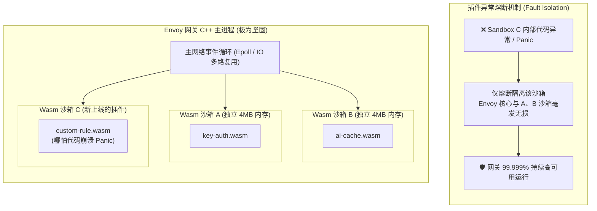
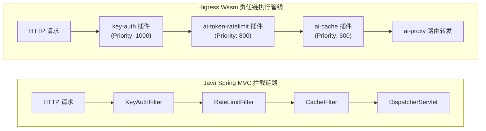

# Higress Proxy-Wasm 插件化底层架构与沙箱隔离机制深度解析

本文档深入解析 Higress 网关如何通过 **WebAssembly (Proxy-Wasm) 沙箱架构** 实现海量插件的 **毫秒级热插拔（Zero-Downtime Hot Reload）**、**物理内存安全隔离（Fault Isolation）** 以及 **多语言开发生态**。

---

## 目录
- [一、 Wasm 独立内存沙箱物理隔离架构图](#一-wasm-独立内存沙箱物理隔离架构图)
- [二、 传统 Java/Nginx 网关与 Wasm 插件机制的核心对比](#二-传统-javanginx-网关与-wasm-插件机制的核心对比)
- [三、 Wasm 插件执行生命周期与 Filter 责任链](#三-wasm-插件执行生命周期与-filter-责任链)
- [四、 为什么 Wasm 能做到毫秒级热插拔与 0 内存泄漏？](#四-为什么-wasm-能做到毫秒级热插拔与-0-内存泄漏)
- [五、 多语言开发支持与选型建议](#五-多语言开发支持与选型建议)

---

## 一、 Wasm 独立内存沙箱物理隔离架构图

---

## 二、 传统 Java/Nginx 网关与 Wasm 插件机制的核心对比

针对 Java 工程师的思维模型对比：

| 维度 | Spring Cloud Gateway (Java) | Nginx (OpenResty / Lua) | Higress (Proxy-Wasm) |
| :--- | :--- | :--- | :--- |
| **底层内核** | Netty / JVM 堆内存 | Nginx C 进程 + LuaJIT | **Envoy C++ 内核 + Wasm 虚拟机沙箱** |
| **新增/修改插件** | **必须重新打包并重启网关进程** (或易发 Metaspace OOM) | 重载 `nginx.conf`，热更新困难 | **毫秒级动态加载 `.wasm` 字节码，0 重启、0 流量中断** |
| **故障隔离性** | ❌ **无隔离** (单个 Filter 死循环/OOM 会击垮整个 JVM) | ⚠️ **弱隔离** (Lua 阻塞导致工作进程卡死) | ✅ **强隔离** (单个 Wasm 沙箱崩溃仅影响单次请求，主底座永不崩溃) |
| **内存管理** | 依赖 JVM GC（大模型 SSE 长连接易引发 GC 停顿） | Lua 内存管理 | **每个沙箱独立线性内存块（4MB），卸载时一键 `free()` 回收** |
| **支持语言** | 仅限 JVM 语言 (Java / Kotlin) | 仅限 Lua | **Go (TinyGo)、Rust、C++、AssemblyScript 等** |

---

## 三、 Wasm 插件执行生命周期与 Filter 责任链

每个 Wasm 插件挂载在 4 个标准的生命周期回调钩子（Lifecycle Hooks）上：
1. **`on_http_request_headers()`**：请求头到达时触发（`key-auth` 提取 Token 鉴权）。
2. **`on_http_request_body()`**：请求体 Prompt 到达时触发（`ai-cache` 计算向量，`ai-security-guard` 审核输入）。
3. **`on_http_response_headers()`**：响应头到达时触发（注入限流状态头）。
4. **`on_http_response_body()`**：大模型 SSE 数据流到达时触发（提取 `total_tokens` 异步原子扣减配额）。

---

## 四、 为什么 Wasm 能做到毫秒级热插拔与 0 内存泄漏？

1. **独立的线性内存块（Linear Memory）**：
   * 每一个 Wasm 插件实例拥有完全独立的专属内存空间（通常为 1MB ~ 4MB）。
2. **热上线（Hot-Load）**：
   * 控制面下发字节码 ➔ Envoy 分配独立沙箱 ➔ 挂入 Filter 链，耗时 `< 5ms`。
3. **热下线 / 热更新（Hot-Unload）**：
   * 旧请求处理完毕后，直接调用底层的内存释放操作，**100% 干净回收，彻底杜绝 Java 类卸载失败导致的 Metaspace 内存溢出**。

---

## 五、 多语言开发支持与选型建议

1. **Rust（性能天花板）**：
   * 零运行时开销（无 GC），编译后 `.wasm` 仅需几百 KB，适合超高并发的计算密集型插件。
2. **Go / TinyGo（最推荐，业务上手极快）**：
   * 语法极其接近 Java 的面向对象编程习惯，Higress 官方提供了极简的 Go SDK 封装，Java 工程师半天即可上手编写生产级插件。
3. **Java 的现状说明**：
   * Java 代码依赖庞大的 JVM 运行时与垃圾回收器，编译为 Wasm 时会将整个基础类库硬打包进去（膨胀至几十 MB），在工程落地中不作为首选。
