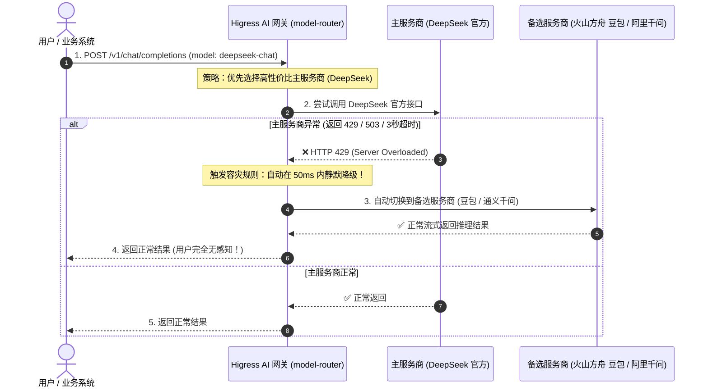

# Higress `model-router` / `ai-proxy`（多模型智能路由与故障自动 Fallback 容灾）深度解析

本文档深入解析 Higress AI 网关的 **高可用容灾与智能故障重试（Fallback）机制**，解决大模型在业务高峰期频繁出现的 `429 Too Many Requests`、`503 Service Unavailable` 以及长时间无响应（超时）痛点。

---

## 目录
- [一、 生产痛点：为什么大模型应用必须配置 Fallback？](#一-生产痛点为什么大模型应用必须配置-fallback)
- [二、 核心工作原理与时序图](#二-核心工作原理与时序图)
- [三、 Higress 的三种容灾路由模式](#三-higress-的三种容灾路由模式)
- [四、 标准配置实战与 YAML 示例](#四-标准配置实战与-yaml-示例)
- [五、 生产高可用建议与架构收益](#五-生产高可用建议与架构收益)

---

## 一、 生产痛点：为什么大模型应用必须配置 Fallback？

在大模型落地生产的过程中，最容易导致业务事故的四大问题：
1. **上游服务商限流（HTTP 429）**：大模型官方 API 在高峰期经常触发全局 TPM/RPM 限制。
2. **算力过载与宕机（HTTP 500/502/503）**：高峰期 GPU 资源紧张，官方直接返回服务不可用。
3. **首字延迟严重恶化（TTFT 超时）**：DeepSeek 或 OpenAI 在推理压力大时，可能 10~20 秒才开始吐出第一个字。
4. **单点依赖风险**：业务系统代码如果写死了某一个云厂商的 SDK，一旦该厂商发生机房故障，整个业务全部瘫痪。

---

## 二、 核心工作原理与时序图

通过在网关层配置 **主备提供商链条（Provider Fallback Chain）**，网关会充当智能调度中心：



---

## 三、 Higress 的三种容灾路由模式

### 模式 1：同模型多账号轮询与互备 (Multi-Key Load Balancing)
* **原理**：配置多个独立的 DeepSeek 官方账号 API Key，按 `50% : 50%` 权重分摊并发；当账号 A 触发 429 额度耗尽时，自动切换至账号 B。
* **适用场景**：单账号 RPM 上限受限，需要聚合多个账号算力的场景。

### 模式 2：跨云厂商同类模型 Fallback (Cross-Vendor Fallback)
* **原理**：
  * **主路线**：DeepSeek 官方 API（价格便宜）
  * **备选路线**：火山方舟 DeepSeek-R1 或 阿里云 DashScope 版 DeepSeek
* **适用场景**：官方接口宕机时，秒级切换到火山/阿里云的算力托管版本，输出效果保持 100% 一致。

### 模式 3：跨模型梯度降级 (Model Tier Degradation)
* **原理**：
  * **第一梯队（默认）**：DeepSeek-V3 / Qwen-Max（高智能、高算力）
  * **第二梯队（兜底）**：豆包-Lite / Qwen-Plus（极速、高可用、成本低）
* **适用场景**：在极端大促或算力不足时，优先保障核心对话不报错，以轻量模型提供兜底服务。

---

## 四、 标准配置实战与 YAML 示例

在 Higress 中，通过 `ai-proxy` 与 `model-router` 插件实现主备容灾与自动重试：

```yaml
# AI 路由容灾配置
services:
  # 主用服务商：DeepSeek 官方
  - name: llm-deepseek.internal.dns
    port: 443
    weight: 100
    retry_on: "5xx,429,connect-failure,refused-stream"
    num_retries: 2
    retry_back_off:
      base_interval: "25ms"
      max_interval: "100ms"

  # 备用容灾服务商：火山方舟豆包 (在主服务连续失败时无缝接管)
  - name: llm-doubao.internal.dns
    port: 443
    weight: 0 # 故障降级备用节点
    is_fallback: true
```

---

## 五、 生产高可用建议与架构收益

1. **SLA 提升至 99.99%**：单云厂商故障不再导致业务停摆，跨云多活成为可能。
2. **零代码改造**：下游业务只需调用统一网关端点，所有重试、超时、跨厂商协议转换全部在网关数据面（C++ Envoy）毫秒级完成。
3. **成本与稳定性的完美平衡**：平时 95% 流量走低成本主模型，仅在 5% 故障抖动时无缝借用备选厂商算力。
