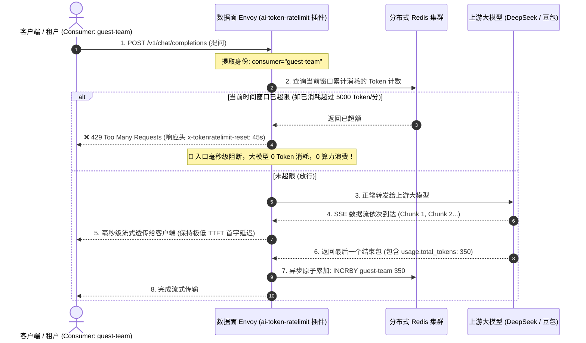

# logical-aigw 大模型 Token 级分布式限流架构与落地实现深度解析

本文档全面梳理并归档了 `api-logical-aigw` 项目中关于 **大模型 Token 级流控与多租户限流体系** 的完整实现方案，涵盖从 **控制面（Go + K8s CRD）** 到 **数据面（Envoy + Wasm 插件）** 以及 **分布式 Redis 滑动窗口** 的端到端全链路细节。

---

## 目录
- [一、 传统网关 QPS 限流 vs AI 网关 Token 限流的核心差异](#一-传统网关-qps-限流-vs-ai-网关-token-限流的核心差异)
- [二、 全景架构与两阶段流式拦截时序](#二-全景架构与两阶段流式拦截时序)
- [三、 控制面（Control Plane - Go）源码级实现](#三-控制面control-plane---go源码级实现)
  - [1. 数据模型定义 (`airoute.go`)](#1-数据模型定义-airoutego)
  - [2. 配置校验逻辑 (`aigateway.go`)](#2-配置校验逻辑-aigatewaygo)
  - [3. WasmPlugin 插件动态渲染与下发](#3-wasmplugin-插件动态渲染与下发)
- [四、 数据面（Data Plane - Envoy + Wasm + Redis）底层算法](#四-数据面data-plane---envoy--wasm--redis底层算法)
  - [1. 分布式 Redis 滑动窗口计数器](#1-分布式-redis-滑动窗口计数器)
  - [2. 前置预判与 0 Token 毫秒级阻断](#2-前置预判与-0-token-毫秒级阻断)
  - [3. 后置异步流式 Token 提取与原子累加](#3-后置异步流式-token-提取与原子累加)
- [五、 双层防线协同：`ai-token-ratelimit` vs `ai-quota`](#五-双层防线协同ai-token-ratelimit-vs-ai-quota)
- [六、 生产配置模板与多租户隔离实战](#六-生产配置模板与多租户隔离实战)
- [七、 生产排查与常见问题 (FAQ)](#七-生产排查与常见问题-faq)

---

## 一、 传统网关 QPS 限流 vs AI 网关 Token 限流的核心差异

| 维度 | 传统网关限流 (Rate Limiting) | AI 时代 Token 限流 (AI Token Rate Limit) |
| :--- | :--- | :--- |
| **度量维度** | **请求次数 (QPS / RPM)** | **真实 Token 消耗量 (TPM) + 请求次数 (RPM)** |
| **计费与算力关联** | 无法感知请求处理的计算开销（1 个字符和 10 万字消耗相同计数） | 严格对齐 GPU 算力显存开销与商业 API 账单成本 |
| **拦截时机** | 请求到达网关入口处即可判定 | **前置根据历史用量判定拦截 + 后置流式提取真实 Token 异步原子累加** |
| **核心业务价值** | 防止下游高频打崩服务器网络连接 | **防止单个租户恶意消耗巨额算力，实现跨部门公平调度与防欠费刷爆** |

---

## 二、 全景架构与两阶段流式拦截时序

大模型调用的核心特征是 **“先接收提问 Prompt，再以 SSE（Server-Sent Events）逐字流式吐出回答”**。网关在数据面采用了 **“前置预判拦截 + 后置流式累加”** 的两阶段闭环机制：



---

## 三、 控制面（Control Plane - Go）源码级实现

`api-logical-aigw` 作为云原生控制面，负责接收用户的 REST API 配置，经过业务校验后动态渲染并下发 Higress 的 `WasmPlugin` 自定义资源（CRD）。

### 1. 数据模型定义 (`pkg/model/meta/airoute.go`)

在 Go 控制面中，限流支持按 **消费者身份（Consumer）、请求头（Header）、URL 参数（Query Param）** 三种维度进行细粒度匹配：

```go
// TokenRateLimit Token限流配置结构
type TokenRateLimit struct {
    Enabled   bool                     `json:"enabled"`
    RuleItems []TokenRateLimitRuleItem `json:"rule_items,omitempty"`
}

// TokenRateLimitRuleItem 单条限流规则项
type TokenRateLimitRuleItem struct {
    MatchCondition MatchCondition `json:"match_condition"` // 匹配维度 (consumer / header / query_param)
    LimitConfig    LimitConfig    `json:"limit_config"`    // 限流阈值与时间单位
}

type MatchCondition struct {
    Type  string `json:"type"`  // "consumer", "header", "query_param"
    Key   string `json:"key,omitempty"`
    Value string `json:"value"`
}

type LimitConfig struct {
    TimeUnit    string `json:"time_unit"`    // "second", "minute", "hour", "day"
    TokenAmount int    `json:"token_amount"` // 允许的最大 Token 数量
}
```

### 2. 配置校验逻辑 (`cmd/csm/app/core/aigateway.go`)

```go
// validateTokenRateLimitConfig 验证Token限流配置合法性
func (core *APIServerCore) validateTokenRateLimitConfig(routeRequest *meta.AIRouteRequest) error {
    if routeRequest.TokenRateLimit.Enabled && len(routeRequest.TokenRateLimit.RuleItems) == 0 {
        return errors.New("token rate limit is enabled but no rule items provided")
    }

    if routeRequest.TokenRateLimit.Enabled {
        for i, item := range routeRequest.TokenRateLimit.RuleItems {
            // 校验匹配类型
            if item.MatchCondition.Type != "consumer" && 
               item.MatchCondition.Type != "header" && 
               item.MatchCondition.Type != "query_param" {
                return fmt.Errorf("invalid match condition type at index %d: %s", i, item.MatchCondition.Type)
            }
            // 校验时间单位
            if item.LimitConfig.TimeUnit != "second" && 
               item.LimitConfig.TimeUnit != "minute" && 
               item.LimitConfig.TimeUnit != "hour" && 
               item.LimitConfig.TimeUnit != "day" {
                return fmt.Errorf("invalid time unit at index %d: %s", i, item.LimitConfig.TimeUnit)
            }
            // 校验 Token 限额
            if item.LimitConfig.TokenAmount <= 0 {
                return fmt.Errorf("token amount must be positive at index %d", i)
            }
        }
    }
    return nil
}
```

### 3. WasmPlugin 插件动态渲染与下发 (`templates/higress/wasm/token-rate-limit.tmpl`)

控制面通过 Go Template 将用户的路由限流规则渲染为 K8s CRD：

```yaml
apiVersion: extensions.higress.io/v1alpha1
kind: WasmPlugin
metadata:
  name: ai-token-ratelimit
  namespace: {{ .Namespace }}
spec:
  defaultConfigDisable: true
  failStrategy: FAIL_OPEN # 故障放行，防止限流故障阻断正常业务
  priority: 600           # 固定执行优先级
  url: {{ .PluginURL }}
  matchRules:
    - config:
        redis:
          service_name: {{ .RedisServiceName }}
          service_port: {{ .RedisServicePort }}
          password: {{ .RedisPassword }}
        rule_name: {{ .RuleName }}
        rule_items:
        {{- range .RuleItems }}
          - {{ if eq .MatchCondition.Type "consumer" -}}
            limit_by_consumer: ""
            {{- else if eq .MatchCondition.Type "header" -}}
            limit_by_header: {{ .MatchCondition.Key }}
            {{- else if eq .MatchCondition.Type "query_param" -}}
            limit_by_param: {{ .MatchCondition.Key }}
            {{- end }}
            limit_keys:
              - key: {{ .MatchCondition.Value }}
                {{- if eq .LimitConfig.TimeUnit "second" }}
                token_per_second: {{ .LimitConfig.TokenAmount }}
                {{- else if eq .LimitConfig.TimeUnit "minute" }}
                token_per_minute: {{ .LimitConfig.TokenAmount }}
                {{- else if eq .LimitConfig.TimeUnit "hour" }}
                token_per_hour: {{ .LimitConfig.TokenAmount }}
                {{- else if eq .LimitConfig.TimeUnit "day" }}
                token_per_day: {{ .LimitConfig.TokenAmount }}
                {{- end }}
        {{- end }}
      configDisable: false
      ingress:
        - {{ .RouteName }}
```

---

## 四、 数据面（Data Plane - Envoy + Wasm + Redis）底层算法

### 1. 分布式 Redis 滑动窗口计数器

插件通过在 Redis 中构造带有精准 TTL（生存时间）的 Key 来维护滑动窗口：

1. **Key 命名格式规范**：
   ```text
   higress-token-ratelimit:{rule_name}:{match_type}:{window_seconds}:{identity}
   ```
   - *示例*：`higress-token-ratelimit:token-limit-chat-route:limit_by_consumer:60:guest-team`
2. **原子递增与过期控制**：
   - 采用 Redis `INCRBY` + `EXPIRE` 原子命令，保证在分布式多 Envoy Pod 并发处理时计数的绝对精确。
   - 窗口过期后由 Redis 自动淘汰历史数据，不产生内存泄漏。

### 2. 前置预判与 0 Token 毫秒级阻断

- 当请求到达网关时，插件提取请求头中的凭证，解析出对应的 `limit_key`；
- 在 Redis 中查询当前时间窗口的累计消耗，如果累计消耗已大于配置阈值：
  - 网关在入口处直接响应 **`HTTP 429 Too Many Requests`**；
  - 响应体输出标准错误格式：`{"error": {"message": "Rate limit exceeded (TPM or RPM)", "type": "requests", "code": 429}}`；
  - 响应头携带 `x-tokenratelimit-reset: <剩余秒数>`，告知客户端何时可以重试；
  - **大模型 0 Token 消耗，0 算力浪费**。

### 3. 后置异步流式 Token 提取与原子累加

- 若前置检查通过，网关将请求放行转发给上游大模型；
- 大模型以 SSE（Server-Sent Events）格式持续吐字；
- 收到流式结束包 `data: [DONE]` 或包含 `usage` 信息的 JSON 帧时，Wasm 插件提取 `usage.total_tokens`；
- 异步向 Redis 发起 `INCRBY`，将实际消耗值累加到该时间窗口的计数器中，完全不阻塞当前流式传输。

---

## 五、 双层防线协同：`ai-token-ratelimit` vs `ai-quota`

在企业生产级大模型治理中，单一限流往往无法满足复杂的财务与算力管控需求。`api-logical-aigw` 提供了 **双层防御体系**：

```
[ 客户端请求 ]
      ⬇️
1. 【第一层：ai-token-ratelimit】(短期突发防护 - Priority: 600)
   • 校验每秒/每分钟/每小时的 Token 吞吐 (TPM) 与并发 (RPM)
   • 作用：防止瞬间高并发脉冲打爆 GPU 显存或触发供应商 429 封号
      ⬇️
2. 【第二层：ai-quota】(长期预算管控 - Priority: 750)
   • 校验企业/部门账户的总余额 (例如充值 5,000,000 Token)
   • 作用：每次请求微秒级扣减余额，余额耗尽直接欠费硬阻断
      ⬇️
[ 转发上游大模型 (DeepSeek / 豆包) ]
```

| 插件名称 | 插件类型 | 作用与防线 | 触发状态码 |
| :--- | :--- | :--- | :--- |
| **`ai-token-ratelimit`** | **短期突发防护** | 按 **秒/分/小时** 控制速率（TPM / RPM），防止瞬间并发把 GPU 算力挤爆。 | `429 Too Many Requests` |
| **`ai-quota`** | **长期预算管控** | 存储租户的月度/总预付余额（如 500 万 Token），每次调用原子扣减余额。 | `429 Quota Exceeded` |

---

## 六、 生产配置模板与多租户隔离实战

### 1. 多租户分级限流配置示例

```yaml
redis:
  service_name: my-redis.dns
  service_port: 6379
  timeout: 2000

rule_name: "enterprise_token_limit"
rejected_code: 429
rejected_msg: "Too Many Requests: Token or RPM limit exceeded!"

rule_items:
  # 场景 A: 按具体消费者独立分配配额 (VIP 与 普通团队)
  - limit_by_consumer: ""
    limit_keys:
      - key: "dianshang-app"     # 电商核心团队 (VIP)
        token_per_minute: 500000 # 独立享受 50万 Token/分
      - key: "customer-service"  # 客服系统
        token_per_minute: 100000 # 独立享受 10万 Token/分
      - key: "wiabao-team"       # 外包团队
        token_per_minute: 5000   # 独立享受 5000 Token/分

  # 场景 B: 兜底 IP 级限流 (防止外部未认证匿名刷量)
  - limit_by_header: "X-Forwarded-For"
    limit_keys:
      - key: "default"
        token_per_minute: 10000
```

---

## 七、 生产排查与常见问题 (FAQ)

### Q1: 为什么在控制面将限流阈值从 5,000 改为 500,000 后，调接口依然报 429？
- **核心原因**：**规则定义是无状态热加载的，但用量计数是有状态持久化的！**
  - 控制面的规则修改通过 xDS 毫秒级推送到 Envoy Wasm 插件生效；
  - 但在修改规则前，该租户在旧规则下已经超额，Redis 中已经写入了带有 TTL（如 60s 或 3600s）的封禁记录；
  - 在 Redis 中的 Key 倒计时未结束前，网关查询依然判定为超限；
- **解决办法**：
  1. 等待当前的 TTL 窗口自然到期；
  2. 或在 Redis 中手动清理历史 Key：
     ```bash
     docker exec higress-redis redis-cli del "higress-token-ratelimit:*"
     ```

### Q2: 为什么长文本生成耗时超过 60 秒时，限流看起来“失效”了？
- **原因**：当规则配置为 `token_per_minute`（1 分钟窗口）时，如果单次推理耗时达到了 65 秒，大模型返回结束包时时间戳已经跨入了下一个新的 1 分钟周期，因此写入的是新周期的计数器。
- **解决建议**：
  1. 将时间窗口从 `token_per_minute` 拉长到 `token_per_hour`（小时级）或 `token_per_day`（天级）；
  2. 搭配 **`ai-quota`（总预算配额插件）** 共同使用。
