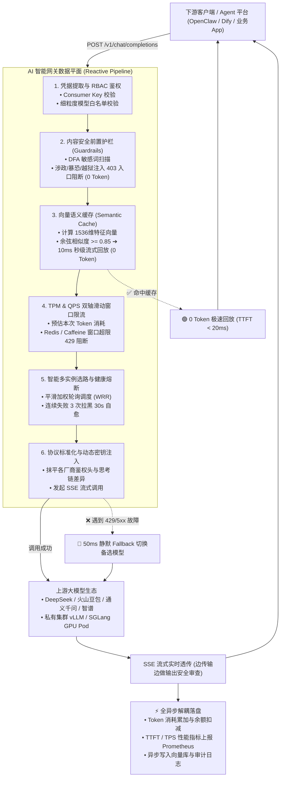

# 面试精选：为什么要有 AI 网关？与传统 API 网关有什么区别？

本文档系统性梳理了 **AI 智能网关（AI Gateway）** 与 **传统微服务 API 网关（Traditional API Gateway）** 的本质区别、设计演进、7 大硬核对比维度，并附带 **大厂面试高频追问与标准应答指南**。

---

## 目录
- [一、 面试一句话黄金总结](#一-面试一句话黄金总结)
- [二、 为什么传统网关无法满足大模型（LLM & Agent）时代？](#二-为什么传统网关无法满足大模型llm--agent时代)
- [三、 核心区别全景对比表（7 大关键维度）](#三-核心区别全景对比表7-大关键维度)
- [四、 AI 网关企业级全景架构与治理流水线](#四-ai-网关企业级全景架构与治理流水线)
- [五、 深入拆解 AI 网关的 6 大核心专属机制](#五-深入拆解-ai-网关的-6-大核心专属机制)
  - [1. 全链路响应式 SSE 流式非阻塞数据面](#1-全链路响应式-sse-流式非阻塞数据面)
  - [2. 异构模型协议标准化与多厂商纳管](#2-异构模型协议标准化与多厂商纳管)
  - [3. 分布式 Token 级双轴动态限流 (TPM + RPM)](#3-分布式-token-级双轴动态限流-tpm--rpm)
  - [4. 向量语义缓存 (Semantic Cache) 与 0 Token 秒回降本](#4-向量语义缓存-semantic-cache-与-0-token-秒回降本)
  - [5. 跨云/跨厂商/跨模型静默 Fallback 容灾](#5-跨云跨厂商跨模型静默-fallback-容灾)
  - [6. AI 专属双向安全护栏 (Guardrails) 与 Prompt 防注入](#6-ai-专属双向安全护栏-guardrails-与-prompt-防注入)
- [六、 面试高频深度追问与标准应答指南 (FAQ)](#六-面试高频深度追问与标准应答指南-faq)

---

## 一、 面试一句话黄金总结

> **传统微服务网关是“微服务流量的路由器”**：核心职责是网络连接接入、URL 路由分发、基于 QPS 防系统打崩；  
> **AI 智能网关是“企业大模型算力的智能中枢与治理中台”**：核心职责是抹平多厂商协议、精准管控 Token 资产、向量语义缓存降本、双向内容合规审查以及跨云静默容灾。

---

## 二、 为什么传统网关无法满足大模型（LLM & Agent）时代？

传统微服务 API 网关（如 Nginx、Kong、Spring Cloud Gateway、Zuul）是针对 **传统 RPC / REST 接口（短连接、毫秒级响应、请求次数度量）** 设计的，在面对大模型流量形态时存在以下致命短板：

1. **短连接变为长耗时流式连接（SSE）**：
   - 传统 RPC 接口通常 50ms 即可返回并释放线程；
   - 大模型推理和思考链生成通常需要 **10秒 ~ 60秒**。使用传统 Tomcat/同步阻塞线程模型，数十个并发就会迅速占满工作线程池，导致整个网关雪崩卡死。
2. **算力与计量维度剧变：QPS $\to$ Token 消耗量（TPM / RPM）**：
   - 传统网关限流只看“每秒调用了几次”；
   - 大模型中，输入 1 个字与输入 10 万字对底层 GPU 显存和推理算力的开销差了 **10 万倍**。传统网关完全无法感知 Payload 中的 Token 数量。
3. **高昂的财务成本与企业预算管控**：
   - 传统微服务调用 10 万次成本接近为 0；调商业大模型 10 万次可能消耗数万元；
   - 企业迫切需要网关层具备 **租户配额（Quota）、部门预算审批、每日用量审计与跨部门财务分摊** 能力。
4. **国家内容安全合规与 Prompt 越狱注入风险**：
   - 传统 WAF 防火墙只能拦截 SQL 注入、XSS 脚本或恶意 IP；
   - 大模型面临的是 **政治敏感、暴恐违禁、违法不良** 以及 **提示词越狱攻击（Prompt Injection / Jailbreak，如诱导大模型突破系统人设）**，必须具备语义级的前置与后置双向合规审查。
5. **外部上游大模型极度不稳定（频繁 429 / 503 / 宕机）**：
   - DeepSeek、OpenAI 等商业官方 API 在业务高峰期经常因算力过载返回 `429 Too Many Requests` 或长达数十秒的卡顿；
   - 业务系统如果硬编码直连某一家厂商，一旦官方发生故障，全线业务停摆。

---

## 三、 核心区别全景对比表（7 大关键维度）

| 对比维度 | 传统微服务网关 (Nginx / Spring Cloud) | AI 智能网关 (Chatling-Gateway / Higress) |
| :--- | :--- | :--- |
| **1. 传输与交互协议** | **短连接 Request-Response**（一次性返回完整 JSON/HTML，50ms 内结束） | **全链路响应式 SSE（Server-Sent Events）** 逐字流式打字传输，万级长连接挂起保活 |
| **2. 限流与流控度量** | **QPS / RPM**（每秒/每分钟请求次数） | **TPM（每分钟 Token 数） + RPM + 租户总预算（ai-quota）** 双轴动态令牌桶 |
| **3. 协议与模型路由** | 按 **URL 路径 / 域名 / 服务发现** 转发到对应微服务集群 | **统一标准 OpenAI 协议**，按请求体里的 `model` 动态分发到 DeepSeek/豆包/文心/私有 vLLM |
| **4. 缓存机制** | **URL / Query 精确匹配**（Key-Value 字符串缓存） | **向量语义缓存（Semantic Cache）**：相似度 $\ge 0.85$ 直接 **10ms 秒级回放，0 Token 消耗**（省钱 40%+） |
| **5. 故障容灾与降级** | 熔断后直接返回静态错误页面或默认 Mock 兜底数据 | **多模型静默 Fallback 容灾**：主模型报 429/503 时，网关在 50ms 内自动改写切到备选模型，**业务 0 感知** |
| **6. 安全与内容防护** | 防 SQL 注入、XSS、DDoS、IP 黑白名单 | **AI 专属双向安全护栏**：DFA 敏感词扫描、涉政暴恐审查、Prompt 越狱注入拦截、流式输出实时熔断、PII 隐私脱敏 |
| **7. 监控与度量指标** | 关注 HTTP RT 响应耗时、网络吞吐带宽 | 关注 **TTFT（首字延迟）、TPS（吐字速率）、Prompt/Completion Token 计量、GPU 排队时长** |

---

## 四、 AI 网关企业级全景架构与治理流水线

---

## 五、 深入拆解 AI 网关的 6 大核心专属机制

### 1. 全链路响应式 SSE 流式非阻塞数据面
- **技术实现**：基于 **Java 17 + Spring WebFlux + Netty + Project Reactor**（或 **Envoy C++ EventLoop**）；
- **核心价值**：单连接仅占用数 KB 内存，单机轻松抗住万级并发长连接挂起，杜绝 Tomcat 线程排队，**显著降低大模型首字延迟（TTFT）**。

### 2. 异构模型协议标准化与多厂商纳管
- **技术实现**：自研 `ModelAdapter` 适配器架构，对外暴露标准 OpenAI 兼容接口（`/v1/chat/completions`）；
- **核心价值**：向下统一抹平 DeepSeek、通义千问、火山方舟、智谱 GLM、Google Gemini 及私有化推理引擎（vLLM、SGLang、Ollama）在端点路径、鉴权 Header 和深度思考链（`reasoning_content`）上的协议差异，**业务端 0 代码改造即可任意切换模型**。

### 3. 分布式 Token 级双轴动态限流 (TPM + RPM)
- **技术实现**：基于 **分布式 Redis / 本地 Caffeine 滑动窗口算法**；
- **核心价值**：兼顾“每分钟 Token 吞吐（TPM）”与“每秒请求并发（QPS/RPM）”，前置预判拦截（超额 429），后置流式异步原子累加，**防止内部租户恶意刷量打崩 GPU 算力**。

### 4. 向量语义缓存 (Semantic Cache) 与 0 Token 秒回降本
- **技术实现**：基于 **1536 维向量 Embedding + DashVector / Milvus 向量库** 进行 Cosine 余弦相似度比对；
- **核心价值**：对于“今天北京天气如何？”与“北京今天天气怎么样？”等同义高频问题，相似度 $\ge 0.85$ 时直接提取历史答案以 15ms/chunk 分帧打字回放，**0 Token 消耗，直接降低企业 40%+ 的商业模型采购账单**。

### 5. 跨云/跨厂商/跨模型静默 Fallback 容灾
- **技术实现**：构建 Provider Fallback Chain 容灾链条与 3 击健康熔断器；
- **核心价值**：当主模型（如 DeepSeek 官方 API）出现网络超时、429 限流或 5xx 宕机时，网关在 **50ms 内原地重写请求并静默转发给备用模型（如火山方舟豆包或阿里云千问）**，业务端 0 报错、完全无感知。

### 6. AI 专属双向安全护栏 (Guardrails) 与 Prompt 防注入
- **技术实现**：DFA 确定有穷自动机 + 国家合规云端绿网（Green 2.0）；
- **核心价值**：
  - **输入端**：在网关入口毫秒级识别涉政、暴恐违禁词及 Prompt 越狱注入攻击，**403 阻断且不产生任何大模型 Token 费用**；
  - **输出端**：在 SSE 流式传输中边传输边实时监测，一旦模型吐出违规内容立即掐断流并替换为合规兜底文案。

---

## 六、 面试高频深度追问与标准应答指南 (FAQ)

### Q1: 既然 Nginx / Spring Cloud Gateway 也能配置支持 SSE，为什么大厂还要专门研发 AI 网关？
> **标准回答**：  
> “支持 SSE 仅仅解决了网络协议层的透传，但根本没有解决大模型治理的核心诉求：  
> 1. 传统网关无法解析请求体内部的 Token 数，做不到 **Token 级（TPM）限流与多租户预算管控**；  
> 2. 传统网关无法实现基于 **向量余弦相似度的语义级缓存**，无法帮企业节省高昂的 Token 费用；  
> 3. 传统网关缺乏大模型专属的 **Prompt 越狱防御、DFA 敏感词护栏、异构模型协议抹平与多厂商静默 Fallback**。  
> 因此，AI 网关是伴随大模型重算力、高成本、强合规特性应运而生的全新基础设施。”

### Q2: AI 网关的限流与传统限流有何本质不同？怎么实现两阶段闭环的？
> **标准回答**：  
> “传统限流只在入口处按请求次数递增；而大模型是 **‘先有提问，后续流式逐步吐出未知长度的回答’**。  
> 我们的 AI 网关采用了 **‘前置预判拦截 + 后置流式累加’** 的两阶段闭环：  
> 1. **前置预判**：根据用户输入的提问字符数粗略预估 Prompt Token，在 Redis 滑动窗口中查询历史用量，若已超标则直接在入口返回 429 阻断，大模型 0 算力浪费；  
> 2. **后置累加**：大模型流式传输完毕后，从结束包中提取真实的 `usage.total_tokens`，异步通过 Redis `INCRBY` 原子累加到该时间窗口中，实现了绝对精准的算力计费与流控。”

### Q3: 向量语义缓存（Semantic Cache）如果遇到向量库延迟高或者挂了，会阻塞正常请求吗？
> **标准回答**：  
> “绝对不会。我们在架构设计上严格贯彻了 **`FAIL_OPEN`（故障放行）** 策略：  
> 1. 语义检索设置了严格的超时阈值（如 50ms）；  
> 2. 一旦向量数据库发生网络抖动、查询超时或服务宕机，网关会**自动忽略缓存直接将请求无感降级转发给真实大模型**；  
> 3. 缓存只是作为降本加速的辅助手段，绝不会成为阻断核心业务调用的单点瓶颈。”
