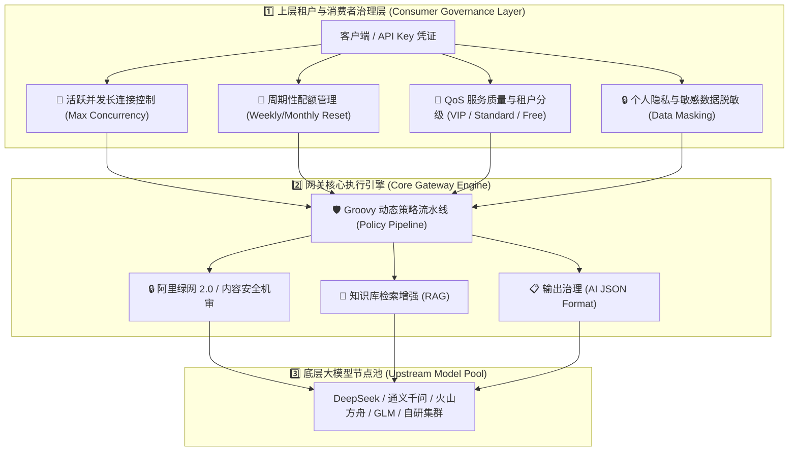
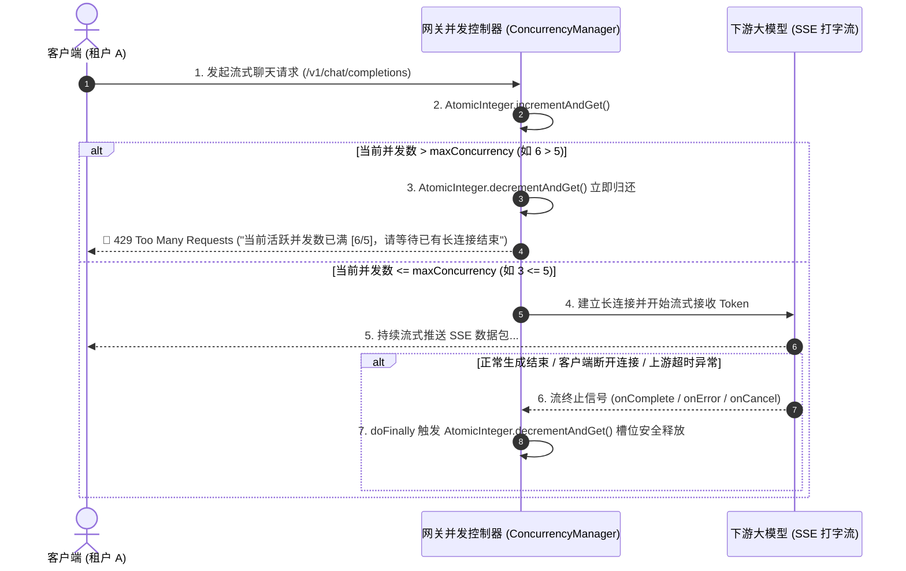
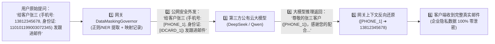

# 企业级大模型网关上层用户治理与 QoS 架构设计规范 (Consumer Governance & QoS Spec)

## 一、 系统现状与设计目标

在大模型（LLM）API 网关体系中，治理能力必须从单一的**底层模型防护（Model-Centric）**扩展为**模型防护 + 上层租户治理（Model & Consumer Dual-Layer Governance）**的双重架构体系。



---

## 二、 核心架构设计

### 1. 最大并发长连接控制 (Max Concurrency Manager)

由于大模型生成推理具有持续时间长（15~30s）的特性，并发控制必须基于响应式流信号（Reactive WebFlux Signals）进行安全生命周期回收。



---

### 2. 企业数据隐私与动态脱敏管道 (Data Masking & Unmasking Pipeline)

保护企业客户隐私数据（手机号、身份证、邮箱、银行卡），防止真实敏感数据直接泄露给公有云第三方大模型。



---

### 3. 服务质量分级与路由调度 (QoS & Priority Routing)

```mermaid
flowchart TD
    Req["客户端请求 model = deepseek-chat"] --> Identify["1️⃣ 识别 API Key 凭证属性与 QoS 租户等级"]
    
    Identify --> Check{"判断 QoS 等级"}
    
    Check -->|👑 VIP 等级 (如 招聘生产核心线)| VIP["• 独享大并发池 (Max Concurrency=50)<br/>• 路由至 VIP 专属低延迟节点<br/>• 异常时毫秒级无缝自动容灾降级 (切换至备用 Qwen-Max)"]
    
    Check -->|⭐ Standard 等级 (常规业务)| STD["• 共享并发池 (Max Concurrency=10)<br/>• 常规排队与重试"]
    
    Check -->|🌱 Free/Test 等级 (测试体验)| FREE["• 严格低并发 (Max Concurrency=2)<br/>• 高峰期主动限流让路<br/>• 异常时降级至轻量低成本模型 (GLM-4-Flash)"]
```

---

## 三、 数据表与字段拓展规划

### 1. `t_api_key` 凭证表扩展：
```sql
ALTER TABLE t_api_key ADD COLUMN max_concurrency INT DEFAULT 5 COMMENT '租户最大活跃并发连接数';
ALTER TABLE t_api_key ADD COLUMN qos_tier VARCHAR(32) DEFAULT 'STANDARD' COMMENT 'QoS等级: VIP, STANDARD, FREE';
ALTER TABLE t_api_key ADD COLUMN quota_cycle VARCHAR(32) DEFAULT 'MONTHLY' COMMENT '配额重置周期: WEEKLY, MONTHLY, NEVER';
ALTER TABLE t_api_key ADD COLUMN cycle_quota_limit BIGINT DEFAULT 1000000 COMMENT '周期重置总额度Tokens';
ALTER TABLE t_api_key ADD COLUMN enable_data_masking INT DEFAULT 0 COMMENT '是否开启数据脱敏: 1开启, 0关闭';
```
