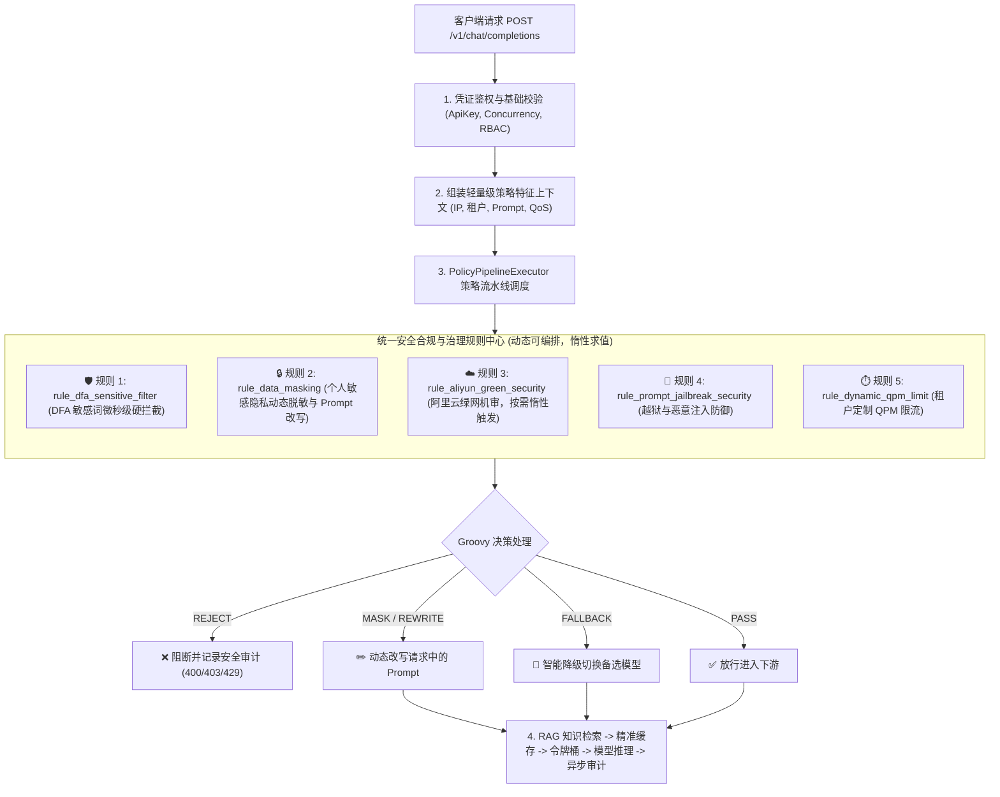

# 安全合规与动态脱敏治理体系架构设计 (Guardrail & Data Governance)

## 一、 为什么将“脱敏”与“绿网机审”从固定代码中彻底解耦？

在改造前，网关存在以下严重的架构硬伤：
1. **API Key 职责污染**：脱敏开关 `enable_data_masking` 被强行绑定在 API Key 凭证上，违反了认证（Authentication）与数据合规（Compliance）的单一职责原则。
2. **硬编码强行调用绿网**：所有流经网关的请求，无论目标是内部私有模型还是公网大模型，都会在 Controller 触发一次阿里云绿网远程 HTTP 同步调用，白白产生 **50~150ms 延迟与外部 API 计费**。
3. **缺乏场景隔离**：代码生成场景下的正常指令（如 `kill -9`、`execute`、`attack`）或单纯的用户业务 ID（11 位数字）容易被硬编码正则与涉敏机审“误杀”。

---

## 二、 改造后的核心架构设计

---

## 三、 关键实现类与代码改造清单

| 模块 | 核心组件 | 职责与改造点 |
| :--- | :--- | :--- |
| `chatling-common` | [`RuleDecision`](file:///Users/a58/Downloads/学习/网关/chatling-gateway/chatling-common/src/main/java/com/chatling/common/rule/RuleDecision.java) | 新增 `MASK / REWRITE` 决策支持，支持携带改写后的文本与状态传递。 |
| `chatling-common` | [`PolicyPipelineResult`](file:///Users/a58/Downloads/学习/网关/chatling-gateway/chatling-common/src/main/java/com/chatling/common/policy/PolicyPipelineResult.java) | 增加 `modifiedPrompt`、`isModified` 等属性，供网关提取脱敏后的最终 Prompt。 |
| `chatling-core-engine` | [`FactorEngine`](file:///Users/a58/Downloads/学习/网关/chatling-gateway/chatling-core-engine/src/main/java/com/chatling/engine/factor/FactorEngine.java) | 升级**高开销特征惰性求值机制**（`f_aliyun_green_status`、`f_masked_prompt` 等仅在策略规则显式请求时才触发计算）。 |
| `chatling-core-engine` | [`RuleExecutorManager`](file:///Users/a58/Downloads/学习/网关/chatling-gateway/chatling-core-engine/src/main/java/com/chatling/engine/rule/RuleExecutorManager.java) | 预置 `rule_dfa_sensitive_filter`、`rule_data_masking`、`rule_aliyun_green_security` 等标准安全规则。 |
| `chatling-core-engine` | [`PolicyPipelineExecutor`](file:///Users/a58/Downloads/学习/网关/chatling-gateway/chatling-core-engine/src/main/java/com/chatling/engine/policy/PolicyPipelineExecutor.java) | 统一接管 DFA 过滤、脱敏改写、绿网机审、短路阻断与降级路由的全生命周期处理。 |
| `chatling-dataplane` | [`GatewayChatController`](file:///Users/a58/Downloads/学习/网关/chatling-gateway/chatling-dataplane/src/main/java/com/chatling/gateway/controller/GatewayChatController.java) | **彻底移除硬编码脱敏、硬编码绿网远程调用和 DFA 过滤**，变成纯粹的网关管道编排器。 |

---

## 四、 核心测试验证结果

已通过全局 Maven 单元测试回归：
- `FactorEngineTest`: 验证特征因子惰性求值与生命周期异步回写机制（PASS）；
- `PolicyPipelineExecutorTest`: 验证脱敏改写、敏感词阻断、越狱拦截与 QPM 动态限流（PASS）；
- 全项目 6 个子模块 `mvn clean test` 全部 **BUILD SUCCESS**。
