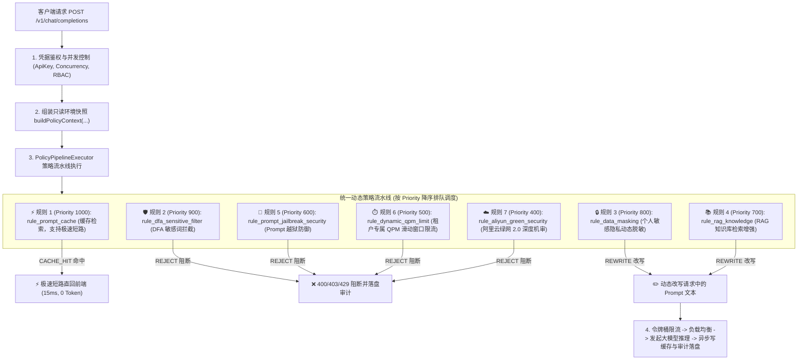

# 全链路统一策略化架构设计 (Unified Policy Pipeline Architecture)

## 一、 为什么将【缓存】和【知识库 RAG】也全面插件化？

在传统网关中，缓存（Exact Cache）和 RAG 通常被硬编码在 Controller 中：
* **传统硬编码的弊端**：
  1. 所有模型无差别查缓存/知识库，无法针对特定模型灵活开启/关闭；
  2. 研发助手或代码模型被无差别注入客服制度，造成**严重的 Prompt 语义污染**；
  3. Controller 代码臃肿，杂糅各种业务 `if-else`。

* **全面策略化改造后的收益**：
  1. **一切皆插件（All-as-a-Plugin）**：缓存、脱敏、敏感词、RAG 知识库、绿网机审、限流、容灾降级遵循统一的 `BaseRuleExecutor` 接口；
  2. **毫秒级极速短路（Fast-Path Short Circuit）**：最高优先级规则 `rule_prompt_cache`（Priority 1000）若命中，直接返回 `CACHE_HIT`，网关立即以 `<15ms` 流式推流并直回，截断后续所有耗时步骤；
  3. **场景精准隔离**：客服模型挂载 `rule_rag_knowledge` 检索知识库，编程模型不挂载知识库，**0 污染、0 额外延迟**。

---

## 二、 全链路动态策略规则池与执行顺序

---

## 三、 核心代码类与职责映射

| 组件 | 类路径 | 核心职责 |
| :--- | :--- | :--- |
| **决策定义** | [`RuleDecision.java`](file:///Users/a58/Downloads/学习/网关/chatling-gateway/chatling-common/src/main/java/com/chatling/common/rule/RuleDecision.java) | 定义 `PASS`、`REJECT`、`FALLBACK`、`MASK`、`REWRITE`、`CACHE_HIT` 决策标准。 |
| **流水线结果** | [`PolicyPipelineResult.java`](file:///Users/a58/Downloads/学习/网关/chatling-gateway/chatling-common/src/main/java/com/chatling/common/policy/PolicyPipelineResult.java) | 携带最终状态、命中规则、改写 Prompt 及缓存全文。 |
| **特征中心** | [`FactorEngine.java`](file:///Users/a58/Downloads/学习/网关/chatling-gateway/chatling-core-engine/src/main/java/com/chatling/engine/factor/FactorEngine.java) | 统一提供 `f_cache_hit`、`f_cached_content`、`f_rag_context`、`f_aliyun_green_status` 的惰性按需计算。 |
| **规则中心** | [`RuleExecutorManager.java`](file:///Users/a58/Downloads/学习/网关/chatling-gateway/chatling-core-engine/src/main/java/com/chatling/engine/rule/RuleExecutorManager.java) | 预置管理缓存、敏感词、脱敏、RAG、越狱、QPM、绿网等 8 大核心 Groovy 规则。 |
| **流水线调度器** | [`PolicyPipelineExecutor.java`](file:///Users/a58/Downloads/学习/网关/chatling-gateway/chatling-core-engine/src/main/java/com/chatling/engine/policy/PolicyPipelineExecutor.java) | 统一调度规则执行、改写流转与缓存短路判定。 |
| **纯净数据面** | [`GatewayChatController.java`](file:///Users/a58/Downloads/学习/网关/chatling-gateway/chatling-dataplane/src/main/java/com/chatling/gateway/controller/GatewayChatController.java) | 纯粹的管道编排器，无任何业务 `if-else`。 |
