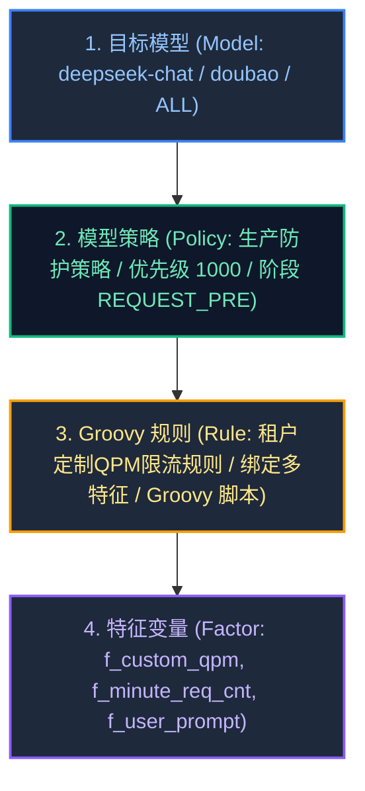
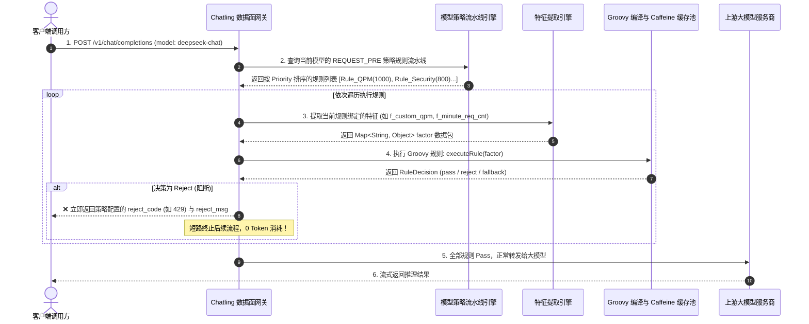

# Chatling AI 网关 · 特征变量、Groovy 规则与模型策略引擎架构设计规范 (Spec)

## 目录
- [一、 核心理念与命名考量](#一-核心理念与命名考量)
- [二、 四层领域模型架构与 ER 设计](#二-四层领域模型架构与-er-设计)
- [三、 数据库表结构设计 (DDL)](#三-数据库表结构设计-ddl)
- [四、 核心组件与运行时执行时序](#四-核心组件与运行时执行时序)
- [五、 原型与交互规范](#五-原型与交互规范)

---

## 一、 核心理念与命名考量

### 1. 命名考量：为什么叫「特征变量 (Factors)」比「元数据 (Metadata)」更合理？
* **元数据 (Metadata)**：语义偏向静态的数据字典和字段描述，无法直观表达“参与业务计算”的动态属性。
* **特征变量 (Factors / Variables)**：
  * 完美承接 58 集团风控系统的 **特征工程 (Feature Factor)** 认知心智；
  * 直观表达了“这些变量是输入给 Groovy 规则进行运算的因子（如 `f_custom_qpm`、`f_minute_req_cnt`、`f_user_prompt`）”。

---

## 二、 四层领域模型架构与 ER 设计



---

## 三、 数据库表结构设计 (DDL)

```sql
-- 1. 特征变量表 (Feature Factor)
CREATE TABLE `t_gateway_factor` (
  `id` bigint NOT NULL AUTO_INCREMENT COMMENT '主键ID',
  `factor_code` varchar(64) NOT NULL COMMENT '特征编码 (如 f_custom_qpm)',
  `factor_name` varchar(128) NOT NULL COMMENT '特征名称 (如 租户定制QPM上限)',
  `data_type` varchar(32) NOT NULL DEFAULT 'String' COMMENT '数据类型 (String/Long/Boolean/Double)',
  `extractor_bean` varchar(128) NOT NULL COMMENT '特征提取器 Spring Bean 名称',
  `description` varchar(512) DEFAULT NULL COMMENT '特征说明',
  `create_time` datetime NOT NULL DEFAULT CURRENT_TIMESTAMP,
  `update_time` datetime NOT NULL DEFAULT CURRENT_TIMESTAMP ON UPDATE CURRENT_TIMESTAMP,
  PRIMARY KEY (`id`),
  UNIQUE KEY `uk_factor_code` (`factor_code`)
) ENGINE=InnoDB DEFAULT CHARSET=utf8mb4 COMMENT='网关特征变量表';

-- 2. Groovy 规则表 (Rule Definition)
CREATE TABLE `t_gateway_rule` (
  `id` bigint NOT NULL AUTO_INCREMENT COMMENT '主键ID',
  `rule_code` varchar(64) NOT NULL COMMENT '规则编码 (如 rule_dynamic_qpm_limit)',
  `rule_name` varchar(128) NOT NULL COMMENT '规则名称',
  `bound_factors` varchar(512) NOT NULL COMMENT '绑定的特征变量列表 (逗号分隔)',
  `groovy_script` text NOT NULL COMMENT 'Groovy 规则源码',
  `owner` varchar(64) NOT NULL DEFAULT 'admin' COMMENT '责任人',
  `status` tinyint NOT NULL DEFAULT '1' COMMENT '状态 (1:启用, 0:停用)',
  `create_time` datetime NOT NULL DEFAULT CURRENT_TIMESTAMP,
  `update_time` datetime NOT NULL DEFAULT CURRENT_TIMESTAMP ON UPDATE CURRENT_TIMESTAMP,
  PRIMARY KEY (`id`),
  UNIQUE KEY `uk_rule_code` (`rule_code`)
) ENGINE=InnoDB DEFAULT CHARSET=utf8mb4 COMMENT='Groovy 规则表';

-- 3. 模型策略与规则关联表 (Model Policy & Rules Mapping)
CREATE TABLE `t_model_policy_rule` (
  `id` bigint NOT NULL AUTO_INCREMENT COMMENT '主键ID',
  `model_name` varchar(64) NOT NULL COMMENT '绑定的目标模型 (如 deepseek-chat 或 ALL)',
  `policy_name` varchar(128) NOT NULL COMMENT '策略名称',
  `stage` varchar(32) NOT NULL DEFAULT 'REQUEST_PRE' COMMENT '处理阶段 (REQUEST_PRE/RESPONSE_POST/ON_ERROR)',
  `rule_code` varchar(64) NOT NULL COMMENT '关联的规则编码',
  `priority` int NOT NULL DEFAULT '100' COMMENT '优先级 (数值越大越先执行)',
  `action` varchar(32) NOT NULL DEFAULT 'REJECT' COMMENT '未通过动作 (REJECT/FALLBACK/PASS)',
  `reject_code` int DEFAULT '429' COMMENT '阻断 HTTP 状态码',
  `reject_msg` varchar(256) DEFAULT NULL COMMENT '阻断提示文案',
  `status` tinyint NOT NULL DEFAULT '1' COMMENT '状态 (1:启用, 0:停用)',
  `create_time` datetime NOT NULL DEFAULT CURRENT_TIMESTAMP,
  `update_time` datetime NOT NULL DEFAULT CURRENT_TIMESTAMP ON UPDATE CURRENT_TIMESTAMP,
  PRIMARY KEY (`id`),
  KEY `idx_model_stage` (`model_name`, `stage`)
) ENGINE=InnoDB DEFAULT CHARSET=utf8mb4 COMMENT='模型策略规则流水线表';
```

---

## 四、 核心组件与运行时执行时序


