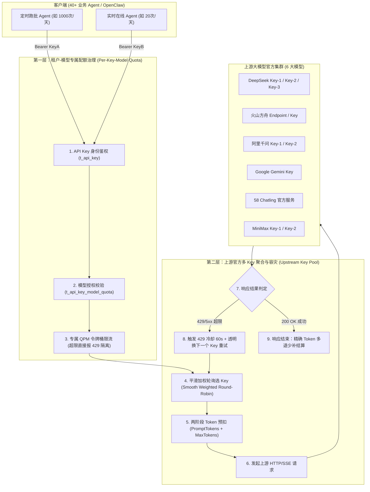
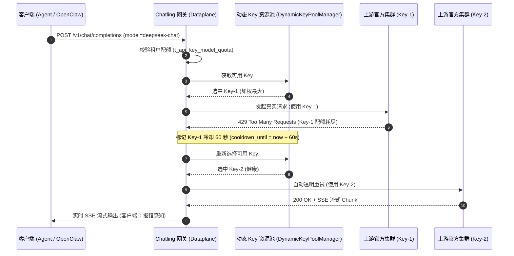

# 40+ Agent 矩阵多租户配额隔离与上游多 Key 资源池容灾设计规范 (Spec)

- **创建日期**：2026-09-01
- **适用工程**：`chatling-gateway`
- **状态**：Draft -> Approved -> Ready for Plan

---

## 1. 背景与业务痛点 (Context & Motivation)

随着企业内部大模型业务的发展，当前网关纳管了 40+ 个异构 Agent（涵盖定时跑批 Agent、实时交互 Agent、代码辅助 Agent 等），并接入了 6 大主力商用大模型（`deepseek-chat`、`ark-code-latest`、`qwen-plus`、`gemini-2.5-flash`、`minimax-m2.5`、`chatling-turbo`）。

在实际生产运行中暴露出以下核心挑战：
1. **吵闹邻居与相互踩踏（Noisy Neighbor）**：定时跑批任务（如批量线索申诉、全量数据质检）在短时间内突发打出大量并发，霸占了上游模型的全局 QPM/TPM 资源，导致实时在线交互的 Agent 频繁遭遇 429 报错；
2. **上游单 Key 限流瓶颈**：DeepSeek、MiniMax、Qwen 等主流商用模型的初始账号通常仅有 60~100 QPM 的速率上限，单个 API Key 无法满足 40 个 Agent 的并发总峰值；
3. **缺乏上游故障透明转移（Failover）**：单个厂商 API Key 遭遇 429 限流或 5xx 故障时，请求直接失败并向上抛出，业务端 Agent 执行被迫中断；
4. **粗粒度授权与配额脱节**：权限审批仅停留在“能不能用该模型”，缺少按模型分配独立 QPM/TPM 预算的闭环控制。

---

## 2. 总体架构与两层治理模型 (Architecture Overview)

系统采用 **「两层治理（2-Tier Governance）」** 扁平化架构：
- **第一层：租户-模型专属配额隔离（Tenant/Key Level）**：按 `API Key + 目标模型` 维度分配独立的 QPM 速率与 Token 预算，超限直接阻断并返回 429，确保各业务 Agent 互不干扰；
- **第二层：上游官方多 Key 聚合资源池（Upstream Key Pool Level）**：网关底层维护多厂商官方 Key 资源池，利用**平滑加权轮询（Smooth Weighted Round-Robin）**分摊压力，遇 429 自动冷却 60 秒并透明秒级换 Key 重试。



---

## 3. 数据库表结构设计 (Database Schema)

### 3.1 新增：`t_api_key_model_quota`（租户-模型专属配额表）
记录每个 API Key 在特定模型上的专属限流与配额预算：

```sql
CREATE TABLE IF NOT EXISTS `t_api_key_model_quota` (
    `id` BIGINT AUTO_INCREMENT PRIMARY KEY,
    `api_key` VARCHAR(64) NOT NULL,          -- 租户 API Key (如 sk-chatling-admin-demo888)
    `model_name` VARCHAR(64) NOT NULL,       -- 逻辑模型名称 (如 deepseek-chat, ark-code-latest)
    `allocated_qpm` INT NOT NULL DEFAULT 60, -- 给该 Key 分配的该模型专属 QPM 速率上限
    `allocated_tpm` INT NOT NULL DEFAULT 120000, -- 给该 Key 分配的该模型专属 TPM 速率上限
    `status` INT NOT NULL DEFAULT 1,         -- 1: 正常可用, 0: 冻结
    `created_time` TIMESTAMP DEFAULT CURRENT_TIMESTAMP,
    `updated_time` TIMESTAMP DEFAULT CURRENT_TIMESTAMP,
    CONSTRAINT `uk_key_model` UNIQUE (`api_key`, `model_name`)
);
```

### 3.2 新增：`t_model_key_pool`（上游官方 Key 资源池表）
记录各逻辑模型绑定的多个官方 API Key、权重与健康状态：

```sql
CREATE TABLE IF NOT EXISTS `t_model_key_pool` (
    `id` BIGINT AUTO_INCREMENT PRIMARY KEY,
    `model_name` VARCHAR(64) NOT NULL,       -- 绑定的逻辑模型 (如 deepseek-chat)
    `api_key` VARCHAR(256) NOT NULL,          -- 厂商真实 API Key
    `weight` INT NOT NULL DEFAULT 1,          -- 加权轮询权重 (默认 1，企业高配账号可配 2 或 5)
    `qpm_limit` INT DEFAULT 60,               -- 该官方 Key 的 QPM 物理限额
    `tpm_limit` INT DEFAULT 120000,           -- 该官方 Key 的 TPM 物理限额
    `status` INT NOT NULL DEFAULT 1,          -- 1: 正常(HEALTHY), 0: 禁用(DISABLED), 2: 冷却中(COOLDOWN)
    `cooldown_until` BIGINT DEFAULT 0,        -- 429 冷却截止时间戳（毫秒，0 表示未冷却）
    `description` VARCHAR(128),               -- 密钥备注（如：主账号Key、备用账号Key-2）
    `created_time` TIMESTAMP DEFAULT CURRENT_TIMESTAMP,
    `updated_time` TIMESTAMP DEFAULT CURRENT_TIMESTAMP
);
```

### 3.3 改造：`t_model_apply`（权限申请与工单审计表）
增加配额申请与审批字段：

```sql
ALTER TABLE `t_model_apply` ADD COLUMN IF NOT EXISTS `requested_qpm` INT DEFAULT 30;
ALTER TABLE `t_model_apply` ADD COLUMN IF NOT EXISTS `allocated_qpm` INT DEFAULT 30;
ALTER TABLE `t_model_apply` ADD COLUMN IF NOT EXISTS `reviewer_name` VARCHAR(32) DEFAULT 'admin';
ALTER TABLE `t_model_apply` ADD COLUMN IF NOT EXISTS `review_comment` VARCHAR(256);
```

---

## 4. 核心组件与算法设计 (Core Algorithms & Components)

### 4.1 平滑加权轮询算法（Smooth Weighted Round-Robin Selector）

借鉴 Nginx 核心分流算法，避免由于权重不同产生的请求聚集，保证流量均匀穿插分摊给多个官方 Key。

#### 算法数据结构与步骤：
对于同一个逻辑模型下的 $N$ 个可用 Key，每个 Key 维护：
- `effectiveWeight`: 配置的固定权重（从数据库同步）；
- `currentWeight`: 运行时动态权重（初始为 0）。

**选 Key 流程**：
1. 过滤：排除 `status == 0`（已禁用）或 `cooldown_until > System.currentTimeMillis()`（冷却中）的 Key；
2. 累加：所有可用 Key 的 $currentWeight \leftarrow currentWeight + effectiveWeight$；
3. 选取：选出 $currentWeight$ 最大的 Key 作为本次使用的 API Key；
4. 衰减：将该 Key 的 $currentWeight \leftarrow currentWeight - \sum_{i=1}^N effectiveWeight$。

---

### 4.2 429 自动冷却与透明重试机制 (Failover & Auto-Cooldown)



---

### 4.3 两阶段 TPM 预扣与精确结算 (Two-Phase Token Reservation)

1. **第一阶段：事前预扣（Pre-Reservation）**：
   $$\text{EstimatedTokens} = \text{PromptTokens} + \min(\text{request.maxTokens}, 1024)$$
   在内存滑动窗口中预扣对应 Token，若超出租户或上游限制，立即返回 `429 Too Many Requests`；
2. **第二阶段：事后结算（Post-Settlement）**：
   在 WebFlux 的 `doFinally` 钩子中提取模型真实返回的 `actualTotalTokens`：
   $$\text{Delta} = \text{EstimatedTokens} - \text{actualTotalTokens}$$
   若 $\text{Delta} > 0$，立即将多扣的 Token 还回滑动窗口，确保统计与限流绝对精确。

---

### 4.4 权限审批中心自动化闭环 (Approval & Quota Automation)

- **申请环节**：业务方在前端点击「申请模型权限」，表单支持输入「申请理由」与「期望 QPM」（默认 30，可选 10~200）；
- **审批环节**：管理员在「权限审批中心」界面查看工单，点击「通过」后，后端事务原子执行：
  1. 将 `t_model_apply.status` 更新为 `1`；
  2. 向 `t_api_key_model_quota` 插入或更新 `(api_key, model_name, allocated_qpm)` 记录；
  3. 刷新网关本地缓存，新权限与专属 QPM 配额即刻生效。

---

## 5. 模块职责与变更范围 (Module Breakdown)

| 模块 | 变更文件 / 新增文件 | 核心职责 |
| :--- | :--- | :--- |
| **`chatling-common`** | • `ModelKeyPool.java`<br>• `ApiKeyModelQuota.java`<br>• `ModelApply.java` | 增加配额与 Key 池实体及 DTO 定义 |
| **`chatling-core-engine`** | • `DynamicKeyPoolManager.java`<br>• `SmoothWeightedRoundRobinSelector.java`<br>• `RateLimiterService.java`<br>• `OpenAiCompatibleAdapter.java` | 实现加权轮询选 Key、429 自动冷却 60s、双重阶梯限流与透明重试 |
| **`chatling-dataplane`** | • `GatewayChatController.java`<br>• `GatewayService.java` | 接入双重配额拦截，执行两阶段 Token 预扣与结算 |
| **`chatling-admin`** | • `AdminService.java`<br>• `AdminApiController.java` | 审批通过时联动写入 `t_api_key_model_quota` |
| **`chatling-bootstrap`** | • `schema.sql`<br>• `LocalDatabaseSecretLoader.java`<br>• `index.html` | 更新表结构、加载多 Key 到资源池表、升级前端申请与审批 UI |

---

## 6. 验证与测试计划 (Verification Plan)

### 6.1 单元测试 (Unit Tests)
- `SmoothWeightedRoundRobinTest`：测试 2 个或 3 个不同权重的 Key，验证 100 次分发的平滑交错性；
- `KeyPoolCooldownTest`：模拟上游返回 429，验证该 Key 立即进入 60 秒冷却，并自动切换下一个可用 Key；
- `ApiKeyModelQuotaLimiterTest`：测试单 Key 在 `deepseek-chat` 上设 10 QPM，发 11 个请求时第 11 个精准返回 429，且不影响其他模型的请求。

### 6.2 端到端集成测试 (End-to-End Integration Tests)
- 模拟批量跑批 Agent（高频并发）与在线实时 Agent（低频交互）同时请求，验证跑批 Agent 超限不挤兑在线 Agent；
- 使用 cURL 与 OpenClaw 发送请求，验证多 Key 场景下流式 SSE 与审计日志完全正常。
